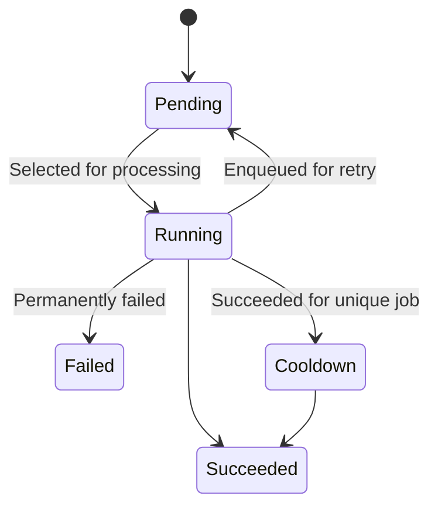

# Ballast Queue Exposed Driver

> [!CAUTION]
>
> Experimental. This module may not still have issues or changes in its public API before being considered stable.
> Please use at your own risk, and file Issues for any problems you may encounter.

## Overview

A Driver implementation backed by a database table with Jetbrains Exposed for database access, designed for server-side 
workloads needing high throughput and safe concurrency.

Supports PostgreSQL databases, with experimental support for MySQL and other dialects possibly supported in the future.

## Supported Platforms

| Platform | Supported |
|----------|-----------|
| JVM      | ✅         |
| Android  | ❌         |
| iOS      | ❌         |
| JS       | ❌         |
| WASM JS  | ❌         |

## Supported Database Engines

| Platform   | Supported | Notes                                    |
|------------|-----------|------------------------------------------|
| Postgresql | ✅         |                                          |
| MySQL      | ⚠️        | Exposed migrations not working correctly |
| SQLite     | ❌         | Planned, development not started         |
| MariaDB    | ❌         | Not Planned, but open for contribution   |
| Oracle     | ❌         | Not Planned, but open for contribution   |

## See Also

- [Exposed](https://www.jetbrains.com/exposed/)
- [Ballast Queue Core](./../ballast-queue-core)

## Usage

This module uses the Exposed DSL to store and query a database table as the persistent store. It uses a specific 
database table schema which is compatible with PostgreSQL and MySQL, and theoretically could work with other database
engines. PostgreSQL and MySQL both support row-level locking `FOR UPDATE SKIP LOCKED`, which is necessary to ensure
exactly-once delivery of a job even when multiple workers are processing the queue in parallel. Other databases without
this feature would need alternative mechanisms for polling the queue safely, which is why they are not supported by
default.

### Job Status

Jobs can be in one of 6 states: 

- `Pending`: This job is waiting to be processed. It will become available once all conditions are ready (delayed 
  start, message groups, etc.) 
- `Running`: This job has been selected by a worker, and is currently running. That worker has exclusive access to the
  across the entire distributed system for the duration of its lease. It's possible that the worker crashes while it 
  held the lease, leaving a job stuck in the `Running` state without actually being processed. A maintenance task is
  needed to detect these jobs and move them back to `Pending` for a retry
- `Succeeded`: The job was successfully processed by a worker, and is considered complete. It may have stored a result
  value that you need to move elsewhere, but otherwise, the work is done and this Job record is a candidate for 
  deletion from the queue by a a maintenance task.
- `Failed`: This job exceeded the max number of retries, and it appears like it will never succeed in its current state.
  It's considered permanently failed. Perhaps a downstream service has moved, or there's a bug in your worker's 
- processing code. Either way, you likely need to manually intervene to correct the issue before manually retrying the 
  job.
- `Cooldown`: A Unique job has completed successfully, but is still holding onto exclusivity for its deduplication key, 
  preventing more jobs at the same key from being inserted. A maintenance task is needed to move jobs from Cooldown to
  Succeeded, allowing a new job at the same deduplication key to be enqueued.
- `Cancelled`: Jobs never enter this state on their own. Rather, by manually updating a job's status to Cancelled while 
  it is `Running`, it will request the worker that's processing the job to cancel the coroutine and stop processing the
  job promptly. It will be treated like a normal failure, either being retried or permanently failed.

Jobs move through these states according to the following state diagram:



### Queue Features and Configuration

This queue supports several features one commonly needs in production-ready applications. These features are all 
derived from the Job payload into `ExposedDatabaseQueueDriver.Metadata`, and stored as columns in the jobs table. See 
below for a description of these features and their related Metadata property and column name.

Queue features are configured by creating an `Adapter` which takes in your type-sfe payload, and returns 
`ExposedDatabaseQueueDriver.Metadata` with the job's configuration. Configurations are always set individually for each
job. YOu may instead use `ExposedDatabaseQueueDriver.DefaultAdapter()` to not use any per-job configuration, and always
use the driver's default values.

```kotlin
public class ExampleAdapter(
    private val clock: Clock = Clock.System,
) : QueueDriver.Adapter<
        ExposedDatabaseQueueDriver.Metadata,
        ExampleContract.Inputs,
        ExampleContract.Events,
        ExampleContract.State
    > {
    override fun getJobMetadata(payload: ExampleContract.Inputs) = ExposedDatabaseQueueDriver.Metadata(
        insertedAt = clock.now(),
        maxAttempts = 5,
    )
}
```

#### Insertion ordering

| Metadata     | Kotlin Type | DB Column    | DB Type              | Default Value     |
|--------------|-------------|--------------|----------------------|-------------------|
| `insertedAt` | `Instant`   | `created_at` | `TIMESTAMP NOT NULL` | Current Timestamp |

Jobs track the moment they were inserted into the queue, and in general, jobs inserted earlier will be processed first
to avoid starvation. However, other features like prioritization, delayed starts, and message grouping will impact the
exact ordering in which jobs are pulled from the queue for processing.

#### Delayed job start

| Metadata | Kotlin Type | DB Column | DB Type              | Default Value     |
|----------|-------------|-----------|----------------------|-------------------|
| `runAt`  | `Instant`   | `run_at`  | `TIMESTAMP NOT NULL` | Current Timestamp |

All jobs have a `run_at` timestamp indicating a time at which the job becomes eligible for processing. It defaults to 
the current moment at the time of job creation, meaning it is available for processing immediately. 

Setting a future `run_at` timestamp will impact the ordering which jobs are delivered for processing, and it will not
prevent jobs submitted later from being processed before a job submitted earlier.

#### Job prioritization

| Metadata   | Kotlin Type | DB Column  | DB Type        | Default Value |
|------------|-------------|------------|----------------|---------------|
| `priority` | `Int`       | `priority` | `INT NOT NULL` | 0             |

Within a single queue, jobs with a higher priority will always be selected for processing before jobs with a lower 
priority. If multiple jobs have the same priority, they will be selected in insertion order within that priority band.

Higher priority will not entirely block lower priority jobs from being selected until all higher priority ones are. 
Also, prioritization does not consider retries, so it's possible for the last job of priority `10` to be selected but 
fail and be re-enqueued for retry, then a job at default priority `0` to be selected and succeed, allowing a lower 
priority job to be processed before a higher-priority job in the same queue. 

You must also be careful not to overuse priority, as jobs with lower priority can experience starvation if there are 
consistently higher-priority jobs in the queue which always take precedence over lower priority ones.

In general, think of priority as a general _suggestion_ of the order in which to run jobs, and use it rarely or ensure 
you have enough workers on the queue to keep the queue empty to prevent low-priority starvation. For stronger, safer 
ordering guarantees, consider using [Message Groups](#message-groups) instead.

#### Deduplication

| Metadata                | Kotlin Type | DB Column                | DB Type          | Default Value |
|-------------------------|-------------|--------------------------|------------------|---------------|
| `deduplicationKey`      | `String?`   | `deduplication_key`      | `TEXT NULL`      | null          |
| `deduplicationDuration` | `Duration?` | `deduplication_duration` | `BIGINT NULL`    | null          |
|                         |             | `unique_until`           | `TIMESTAMP NULL` | null          |

Uniqueness can be enforced across the entire system, preventing jobs with the same key from being inserted into the 
queue. If `deduplicationKey` is set, `deduplicationDuration` must also be set, indicating period of time which the 
uniqueness is considered in "cooldown". As long as a job is currently in `Pending`, `Running`, or `Cooldown` states, 
another job cannot be inserted into the queue with the same `deduplicationKey`. This is useful for situations like 
debouncing jobs inserted into the job on a schedule, so you don't need to do synchronization between multiple pods
each running and inserting jobs on a schedule in parallel.

Jobs are unique from `run_at + deduplication_duration`, set in the `unique_until` column at the time of job creation.
This time is not updated if the job fails an is retried, but in the case of retries it will be moved from `Running` 
back to `Pending`, thus still holding uniqueness until it either succeeds or permanently fails.

Jobs in Cooldown are not automatically moved to Succeeded to free the unique constraint. You must run 
`JobsMaintenanceRepository.freeJobCooldowns()` to move all jobs in `Cooldown` past their `unique_until` timestamp into
`Succeeded` and allow another job at this key to be inserted.

#### Message Groups

| Metadata       | Kotlin Type | DB Column       | DB Type     | Default Value |
|----------------|-------------|-----------------|-------------|---------------|
| `messageGroup` | `String?`   | `message_group` | `TEXT NULL` | null          |

Message groups allow you to make FIFO queues similar to Amazon SQS, where jobs in the same message group can only have 1
currently running at a time. Other jobs with the same `message_group` may be inserted into the queue, but only 1 job
within that group will be able to run at a time, across the entire pool of workers. 

While this may sound similar to [Deduplication](#deduplication), it serves different purpose. Deduplication is about 
debouncing the same job so the same task doesn't accidentally get processed twice. Message groups are for protecting 
access to the same shared resource across multiple jobs. As such, deduplication typiccally uses the name of the job as
the deduplication key, while message groups should us something like a `userId` to ensure jobs which modify data for the
same user are not running in parallel, corrupting each other's work.

#### Automatic Retries

| Metadata      | Kotlin Type | DB Column      | DB Type          | Default Value |
|---------------|-------------|----------------|------------------|---------------|
| `maxAttempts` | `Int`       | `max_attempts` | `INT NOT NULL`   | 5             |
| `retryUntil`  | `Instant?`  | `retry_until`  | `TIMESTAMP NULL` | null          |

Whenever a job is unable to complete successfully, it may be moved to the `Failed` if it cannot be retried, or it may be
moved back to the `Pending` state if it is eligible for retry. Jobs can fail for many reasons, including:

- timeouts
- explicit cancellation
- worker process crashes
- exceptions thrown during processing

In all cases, whenever we need to determine how to deal with the issue, the job will be checked for retry eligibility. 
Jobs are eligible for retry if:

- The current number of `attempts` is less than `max_attempts` AND
- if `retry_until` is not null, the current time is less than `retry_until`

If you wish to not worry about number of attempts and always attempt a retry until a given time, set `max_attempts` to 
an arbitrarily high value like `Int.MAX_VALUE`. 

#### Crash Protection

| Metadata               | Kotlin Type | DB Column               | DB Type           | Default Value |
|------------------------|-------------|-------------------------|-------------------|---------------|
| `leasedAt`             | `Instant?`  | `leased_at`             | `TIMESTAMP NULL`  | null          |
| `leasedBufferDuration` | `Duration`  | `lease_buffer_duration` | `BIGINT NOT NULL` | 30 seconds    |
| `leasedUntil`          | `Instant?`  | `leased_until`          | `TIMESTAMP NULL`  | null          |
|                        |             | `timeout_duration`      | `BIGINT NOT NULL` | 30 seconds    |

Sometimes things don't go as planned, and your application process crashes or is forcibly shut down while a worker is
currently processing a job. Unfortunately, there's not much that can be done during the application process to recover
the job gracefully at the time the server is shut down. But as a protection against this scenario, when a job is claimed
from the queue by a worker, it is given a lease on that job to prevent it from being stuck in the `Running` state 
indefinitely. 

When a job starts running, the `leased_until` property is set to `currentTime + timeout_duration + lease_buffer_duration`.
This means that if the job is actively running, it will either complete or timeout before the lease expires. But if the
process crashes, the job will only be stuck in the `Running` state for at most `timeout_duration + lease_buffer_duration`,
after which time the job can be released back to the queue for retry with `JobsMaintenanceRepository.retryHungJobs()`. 
The lease buffer ensures jobs currently running will not get moved back to the queue for retry. 

### Component Details

#### Jobs Table

The `JobsTable` is an abstract class defining the database table schema which holds jobs, and which will be polled to 
consume and attempt to process jobs. It is an [Exposed IdTable](https://www.jetbrains.com/help/exposed/working-with-tables.html)
using UUIDs as the job's primary key. Use `JobsTable.Default` as the primary top-level object to use this table with a
predefined table name of `jobs`. If you would like to use a different table name, you will need to maintain your own 
singleton instance of `JobsTable` with your custom table name, and pass that to the Exposed QueueDriver.

```kotlin
// use the JobsTable schema, but with a different table name
object AppJobsTable : JobsTable("app_jobs")

val database = Database.connect(...)
val repository = JobsRepositoryImpl(database, AppJobsTable)
val driver = ExposedDatabaseQueueDriver(repository)
```

#### JobsRepository

The Driver itself delegates all SQL to the `JobsRepository`, implemented by `JobsRepositoryImpl`. You will need to 
create and manage the state of this Repository yourself, providing an explicit [database connection](https://www.jetbrains.com/help/exposed/working-with-database.html).

Internally, the `JobsRepository` is stateless apart from the database itself, and does not have any long-running jobs or
in-memory caches. It's intended to be a stateless, and more semantic, interface to the underlying database table. All
SQL executes in a suspending transaction using the explicit `Database` instance passed to the `JobsRepositoryImpl` 
constructor, to ensure consistent behavior throughout your app even if you use a different database for your Jobs table.
This database has only been tested with JDBC, but support for R2DBC is planned.

#### JobsMaintenanceRepository

By default, the Exposed job queue driver does not perform any maintenance to the jobs table, since organizational 
compliance needs and application requirements may impact how often such maintenance tasks as deleting old jobs need to
be performed. `JobsMaintenanceRepository` encapsulates the common maintenance needs of the JobsTable, but it will be 
left to you to actually schedule and call these tasks. Fortunately, these tasks can be easily scheduled with 
[Ballast Scheduler](./../ballast-scheduler-core).

Maintenance needs for the Jobs table are:

- `JobsMaintenanceRepository.deleteOldJobs()` -  Jobs are not automatically deleted when they complete successfully, 
  since they may contain a result payload that's needed by other application logic. Periodically, old jobs should be 
  deleted once they've been fully handled, to ensure the table does not grow indefinitely with rows that are not needed.
- `JobsMaintenanceRepository.freeJobCooldowns()` - Jobs with a deduplication key may hold a cooldown for an arbitrary 
  period of time after completing, which is not automatically released once the cooldown expires. You will need to run
  this task to look for jobs still holding a cooldown, and move them to a `Success` state so another job with the same
  key can be enqueued.
- `JobsMaintenanceRepository.retryHungJobs()` - If the server process crashes while a job is in progress, it will remain
  in the `Running` state, even though there is no worker actively working on the job. Jobs are leased from the queue 
  with an expiry slightly longer than their timeout value, so if the server crashes, those jobs will eventually lose 
  their lease and be eligible for this task to move them back to a `Pending` state to be retried.

## Installation

```kotlin
repositories {
    mavenCentral()
}

// for plain JVM projects
dependencies {
    implementation("io.github.copper-leaf:ballast-queue-exposed-driver:{{ballastVersion}}")
}

// for multiplatform projects
kotlin {
    sourceSets {
        val jvmMain by getting {
            dependencies {
                implementation("io.github.copper-leaf:ballast-queue-exposed-driver:{{ballastVersion}}")
            }
        }
    }
}
```
