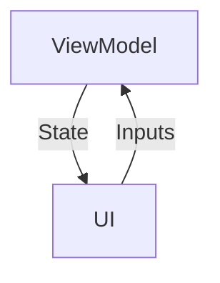
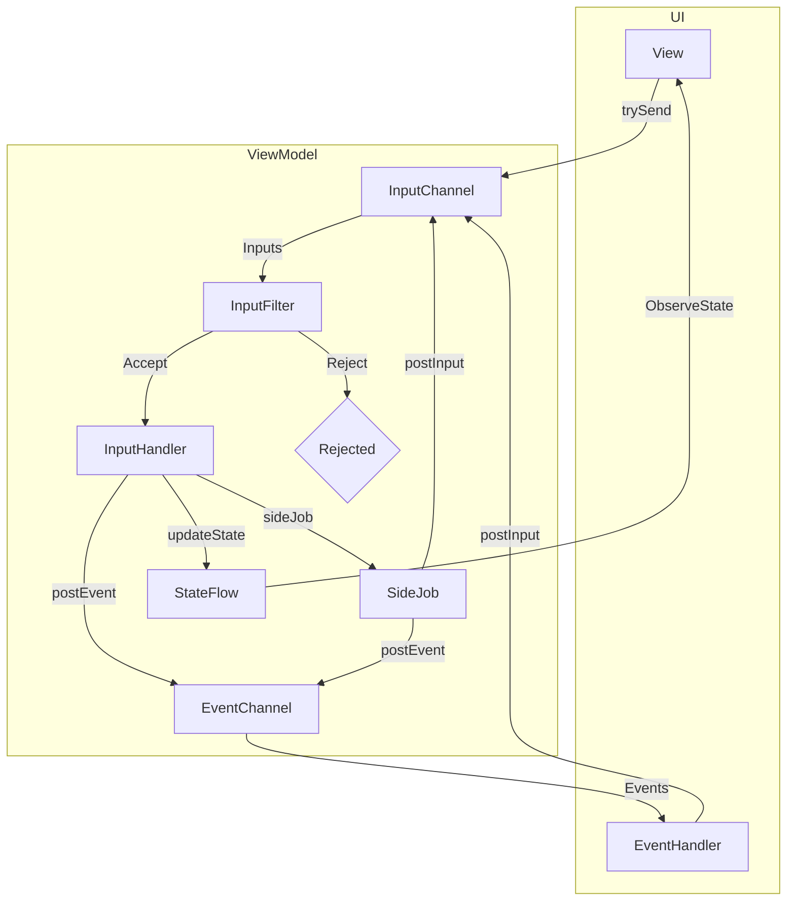

---
---

# Thinking in Ballast MVI

## Ballast Overview

Ballast is a library implementing an opinionated structure of the MVI state management architecture pattern, based on
the concept Unidirectional Data Flow. This pattern has been used and implemented by a variety of libraries across many
languages and under a variety of names, such as [Flux][1], [Redux][2], [Vuex][3], [The Elm Architecture][4], [MVI][5],
[UDF][6], etc. The idea behind all these libraries is sound and leads to clean UI architecture, and Ballast is just one
particular way to do it. The above links are also good sources for understanding this pattern more generally, as well.

The core idea is to model your UI not as discrete UI elements with click listeners, changing text, local state, etc.
that all needs to be synced and updated manually, but instead to lift that state into a ViewModel and update the entire
UI whenever the ViewModel state changes. This idea of "lifting state" naturally forms a loop in your UI, where:

- the **ViewModel** holds **State**, which gets pushed to the UI with every change
- the UI updates itself to match the current **State**
- The user interacts with the UI, producing **Inputs**, or their "intent" to change the UI state.
- The **Inputs** get sent back to the **ViewModel**, where it processes the **Inputs** to change the State

Notably, in this loop, the UI is never responsible for updating the **State** itself, and there is no business logic
code that depends on any data held anywhere but the **State**. The UI only dispatches **Inputs** directing the ViewModel
to update the state, and all processing is done within the **ViewModel**, asynchronously, and any changes to the
**State** as a result of processing an **Input** will be pushed back to the UI automatically. You can visualize the loop
like so:



This diagram is the simplest form of MVI, but Ballast adds a bit more structure and more features to this core loop,
which are needed to build a fully-functional and _safe_ UI "state machine". Ballast itself is built around Kotlin
[Coroutines](https://kotlinlang.org/docs/coroutines-overview.html),
[Structured Concurrency](https://elizarov.medium.com/structured-concurrency-722d765aa952),
and [Flows](https://kotlinlang.org/docs/flow.html), though familiarity with them is not strictly necessary to use
Ballast. A more complete diagram of the Ballast MVI model looks more like the diagram below. See
{{ 'Features' | anchor }} for more information on the features described in this diagram.



## UI Programming Through the Years

To better understand the MVI pattern, how Ballast implements it, and why certain things are done in this way, let's go
back in time and walk through the evolution of UI programming through the years to understand how MVI came to be the
favored pattern that it is today.

Note that this brief history is based on my personal experiences and observations over the last ~10 years of software
development, and draws heavily from a native Android and web dev perspective. You may have a different opinion on the 
exact timelines, descriptions, pros, or cons of certain patterns, but I'm not looking to start an argument. I'm simply 
wanting to show the evolution that I have observed, that ultimately led to the Ballast MVI library as it stands today.

### Traditional UI programming

In traditional UI programming, there is no separation (or only superficial separation) between the UI elements and the 
code that is run when interacting with those elements. Take the following snippet, which is something you might see in a
traditional Android Activity's UI implementing a simple counter:

```kotlin
override fun onCreate() {
    setContentView(R.layout.activity_main)
    val button: Buttoon = findViewById(R.id.button)
    val counterText: TextView = findViewById(R.id.counter_text)

    button.setOnClickListener {
        val currentCount = counterText.text.toString().toInt()
        val incrementedCount = currentCount + 1
        counterText.setText("$incrementedCount")
    }
}
```

For comparison, here's the same thing in HTML/JS.

```js
var button = document.getElementById("button");
var counterText = document.getElementById("counter_text");

function handleClick() {
    var currentCount = parseInt(counterText.textContent)
    var incrementedCount = currentCount + 1
    counterText.innerHTML = incrementedCount
}
button.onclick = handleClick
```

This approach, so common in many older applications, has a number of problems:

- How do we get the current counter value?
    - Answer: get the text directly from the UI element, and parse it to a String
- What happens if the text in the UI element is not a valid number?
    - Answer: `¯\_(ツ)_/¯`
- What happens if the button is clicked many times very quickly?
    - Answer: Clicks must be handled on the main UI thread, to make sure there are no race conditions
- Ok, but what if it does get called quickly from many different threads?
    - Answer: `¯\_(ツ)_/¯`
- How do I test this code?
    - Answer: You'll need to run your tests in a real device/browser or emulated environment
- What if that button click needs to make an API call?
    - Answer: You'll need to run that code in the background, receive the callback on the main thread, and update the UI in that
      callback
- What if the data stored in the UI changes by the time the API call returns?
    - Answer: `¯\_(ツ)_/¯`
- I saw a really strange bug report. How can I reproduce that bug?
    - Answer: Manually follow the exact series of steps that put the user in that scenario
- How do I figure out those steps that the user did?
    - Answer: `¯\_(ツ)_/¯`
- What if the UI state is a result of parallelism and was a freak occurrence?
    - Answer: `¯\_(ツ)_/¯`

### MVP

- _Not really used on Web_
- _2013 to 2019 on Android_

Early attempts to solve these problems started to spring up, especially with the **MVP** pattern on Android. The main 
idea here was to move all the "business logic" code out of the "view" and into a "presenter" class. The View connects 
all its clicks and other interactions to call methods on the Presenter, and the Presenter acts as fake "view" so the 
code isn't directly tied to the Android View or Browser.

```kotlin
class CounterPresenter(private val view: CounterView) {
    private var currentCount = 0
    fun onButtonClick() {
        val incrementedCount = currentCount + 1
        view.setCounterText("$incrementedCount")
        currentCount = incrementedCount
    }
}

interface CounterView {
    fun setCounterText(text: String)
}

class CounterActivity : AppCompatActivity(), CounterView {

    override fun onCreate() {
        setContentView(R.layout.activity_main)
        val button: Buttoon = findViewById(R.id.button)
        val presenter = CounterPresenter(this)

        button.setOnClickListener {
            presenter.onButtonClick()
        }
    }

    override fun setCounterText(text: String) {
        val counterText: TextView = findViewById(R.id.counter_text)
        counterText.setText("$incrementedCount")
    }
}
```

This approach gained a lot of popularity because it allowed one to test the busisness logic in a normal unit test, 
without needing a full real or emulated environment. But this approach has a number of flaws, some of which are inherent
in its design, and some are just problems with the real-world implementation of it.

- The Presenter had to add a `currentCount` variable, since it no longer has direct access to the View to read the 
  current text in the UI element. We now have the same value in 2 separate places.
- What if we want to change the `currentCount` variable from multiple places?
  - Answer: We need to make sure that code updates both the internal variable and the UI element
- What's the value shown in the UI before clicking the button?
  - Answer: We need to make sure the default value in the UI matches that of the Presenter's value.
- What if I need to make a really quick addition to the UI. Do I really have to jump through all these hoops? 
  - Answer: Yes. The MVP pattern means you need to add all the boilerplate for it.
- But this really needs to go out quickly. I'm just going to do it the normal way.
  - Answer: I mean, I can't really stop you, but you really shouldn't...

And this is the main reason why I personally don't think MVP is a very good design pattern. It is really only a 
superficial separation, but you're basically writing the same code you would normally but with much more boilerplate.
There is nothing in the pattern itself that requires you to follow it, and in practice, it's likely you'll run into 
portions of code that do not follow the pattern strictly, giving you a frankenstein mix of code split between 
programming styles, and state being held all over the place, leaving you worse off than not having the MVP pattern at 
all.

MVP: Good in theory, but rarely implemented well in practice.

### MVVM

- _2010 to 2016 on web with Angular.JS_
- _2016 to 2019 on Android with Databinding, but never became too popular_

Once everyone started noticing the problems inherent in traditional- and MVP-style UI programming, the natural fix 
became pretty apparent: rather than the interactions driving the UI, let's use a state model to drive the UI. One starts
by developing creating a model of the screen's state, and then builds a UI that is assembled or synchronized to match 
that model.

These are the early days of reactive programming, when Angular.JS because king, React was just starting to be developed, 
and all the UI toolkits started creating their own "MVVM" frameworks. The main idea with these is that you take 
something like a "Presenter" or "Controller" class, declare the state that lives within that Controller, and let a 
framework worry about applying that state to the UI for you. Additionally, the MVVM frameworks bind in the other 
direction, too, automatically wiring up click listeners and such so that they always run code in the Controller.

This was a huge improvement over the previous attempts. We now have a way to make sure any changes to the state will 
always be present in the UI, even changes made from other threads, and the framework enforces that all changes to the
UI must go through the Controller and the MVVM framework.

MVVM started with Angular.JS and we started seeing MVVM frameworks popping up everywhere: Android, Xamarin, a thousand
different Javascript frameworks, etc. But MVVM is not without its issues: most notably being that the MVVM framework 
needs to have intimate knowledge of both the View and your Controller. The framework itself would have to be updated 
anytime the underlying Views changed, as well as knowing about all container types that might hold data in the 
Controller, to know how to convert those values into something displayed in the UI. 

As a result, MVVM frameworks tended to lag behind the actual frameworks themselves, the frameworks themselves were 
pretty large and might not always have the best performance, and especially for things like displaying lists of content,
it was just more difficult than it needed to be. 

### MVI

- _2013 to now on web, with React_
- _2019 to now on Android, with Compose_
- _2019 to now on iOS, with Swift UI_
- _2017 to now with Flutter_

MVI was the next iteration of UI programming, and by all accounts it seems to be the one that will stick around. It 
solves many of the problems outlined with traditional programming, but does it in a much more lightweight and 
unobtrusive way than MVVM, giving all the power back into the hands of the programmer and allowing them to write the 
same code they would expect when working with a UI toolkit, but providing structure around the state and interactions 
required of the UI.

The core difference between MVVM and MVI is this: MVVM uses an automated middle-man to apply state to UI and send 
change requests from the UI to the Controller (or ViewModel). MVI forgoes that middleman and implements a more 
transparent mechanism for moving State and Inputs between the UI and ViewModel, and asks the programmer to be that 
middle-man. Instead of automatically applying the State to the UI, the MVI pattern gives the programmer the State that
should be applied to the UI, and allows the programmer to pick their UI toolkit and programming style to apply the 
State themselves.

This idea is what Facebook started with the Flux architecture and React, and soon afterwards you started seeing more and
more platforms rewriting their UI toolkits around this exact philosophy. Flutter, Swift UI, Jetpack Compose, all based 
around this idea that the UI shouldn't have to manage anything itself, but should be driven entirely by some model of
State and applied to the UI with hand-written code. 

This MVI model has proven itself over the last few years to be incredibly durable and robust, even useful outside of 
pure UI applications. And the more I work on Ballast and really figure out how this pattern works, the more flexible and
powerful I find it to be, enabling all sorts of incredible use-cases that are simply impossible with traditional 
programming techniques, like time-travel debugging, undo/redo, multi-user synchronization, and many others.

Hopefully this brief history of UI programming has given you some things to think about which will help you understand 
more about the specific design choices of Ballast, as outlined throughout the rest of this document.

## UI Contract

All of Ballast was designed around an opinionated way to write your UI code to optimize the MVI pattern and make all 
your application screens/components look and work very similarly. It all starts with creating a "Contract", and from
there we'll work to allow Ballast to manage that Contract.

### Modeling a UI Contract

The convention with Ballast is to use one Ballast ViewModel for each screen in your application, and to create a
"contract" for interfacing your UI to the screen's ViewModel. Note that Ballast works well with Compose or other
declarative UI frameworks, but the model will still hold true even with standard Android Views as long as you make sure
to manually update the UI widgets' state to match the ViewModel state. Anyway, start by defining the "contract", for
example, a login screen.

```kotlin
object LoginScreenContract {
    data class State(
        ...
    )

    sealed class Inputs {
        ...
    }

    sealed class Events {
        ...
    }
}
```

Each Contract is a top-level `object` with a nested `State` `data class`, and `sealed class`es for `Inputs` and `Events`.

`State` is the persistent state of the ViewModel, which will get pushed to the UI anytime it changes. The UI should
update itself to display what's in that `State`, and in doing so will always be kept consistent with that State.

`Inputs` are how the UI communicates back to the ViewModel. Each discrete action in the UI, each click listener, text
changed listener, etc. should be separate classes within the `Input` sealed class. Each `Inputs` subclass is should be
an `object` if the UI element doesn't directly deliver data to the ViewModel (a click listener), or a `data class` if
it does need to deliver data (text changed). Don't worry about what to do with those yet, the Contract just defines the
"what".

`Events` are modeled similar to Inputs, but in the other direction; Events are sent from the ViewModel to be processed
exactly once by the UI. This would typically be things like requests to navigate to another screen.

Filling out the above contract for a Login Screen might end up looking like this:

```kotlin
object LoginScreenContract {
    data class State(
        val username: TextFieldValue,
        val password: TextFieldValue,
    )

    sealed class Inputs {
        data class UsernameChanged(val newValue: TextFieldValue) : Inputs()
        data class PasswordChanged(val newValue: TextFieldValue) : Inputs()
        object LoginButtonClicked : Inputs()
        object RegisterButtonClicked : Inputs()
    }

    sealed class Events {
        object NavigateToDashboard : Events()
        object NavigateToRegistration : Events()
    }
}
```

### What Not to put in a UI Contract

Obviously, the initial thought when building out a Contract is to put every single variable into the State, and you
absolutely can do that. But with sufficiently large screens, this may become a bit too verbose and introduce a lot of
back-and-forth jumping between the UI and the VM, which may not be strictly necessary. Assuming your entire UI,
including its listeners, is updated with each state change (both local and ViewModel states), you can leave some amount
of logic purely in the UI, and have the State and Inputs only model the things which are actually important from a 
business logic perspective.

As an example, let's take a Checkout screen. At the end of the flow, once the user has entered all their information, we
want to show a popup to confirm the user actually wants to submit the order to help prevent accidental clicks submitting
it for them. If we had the logic for this popup in the Contract, it would look something like this in Jetpack Compose:

```kotlin
object CheckoutContract {
    data class State(
        val cart: List<CartItem>,
        val isConfirmationDialogShowing: Boolean, // whether the popup should be open
    )

    sealed class Inputs {
        ...

        object CheckoutButtonClicked : Inputs() // open the popup
        object ConfirmationDialogCheckoutButtonClicked : Inputs() // submit the order
        object ConfirmationDialogCancelButtonClicked : Inputs() // close the popup
        object ConfirmationDialogDismissed : Inputs() // close the popup
    }

    sealed class Events {
        ...
    }
}

@Composable
fun Checkout(state: CheckoutContract.State, postInput: (CheckoutContract.Inputs)->Unit) {
    ItemsInCard(state.cart)

    Button(onClick = { postInput(CheckoutContract.Inputs.CheckoutButtonClicked) }) {
        Text("Checkout")
    }

    if(state.isConfirmationDialogShowing) {
        AlertDialog(
            onDismissRequest = {
                postInput(CheckoutContract.Inputs.ConfirmationDialogDismissed)
            },
            text = {
                Text("Submit order?")
            },
            confirmButton = {
                Button(onClick = { postInput(CheckoutContract.Inputs.ConfirmationDialogCheckoutButtonClicked) }) {
                    Text("Submit")
                }
            },
            dismissButton = {
                Button(onClick = { postInput(CheckoutContract.Inputs.ConfirmationDialogCancelButtonClicked) }) {
                    Text("Cancel")
                }
            }
        )
    }
}
```

Now, there's nothing wrong with this, it's just a bit verbose. And looking at this snippet, it's not immediately obvious
that the purpose of all this code is just to show a confirmation dialog before submitting the order. It muddies up the
actual intent and logic of this screen with a bunch of boilerplate, and since all of these events basically just toggles
a Boolean property, it's not really necessary to have all the structure and protections of Ballast managing it. A better
way to handle it is to leave the popup logic entirely in the UI and understand that popup to just be a UI detail, but
not something business-critical that needs to be modeled in the Contract:

```kotlin
object CheckoutContract {
    data class State(
        val cart: List<CartItem>,
    )

    sealed class Inputs {
        ...

        object CheckoutButtonClicked : Inputs() // submit the order
    }

    sealed class Events {
        ...
    }
}

@Composable
fun Checkout(state: CheckoutContract.State, postInput: (CheckoutContract.Inputs)->Unit) {
    ItemsInCard(state.cart)

    var isConfirmationDialogShowing by remember { mutableStateOf(false) }

    Button(onClick = { isConfirmationDialogShowing = true }) {
        Text("Checkout")
    }

    if(isConfirmationDialogShowing) {
        AlertDialog(
            onDismissRequest = {
                isConfirmationDialogShowing = false
            },
            text = {
                Text("Submit order?")
            },
            confirmButton = {
                Button(onClick = { postInput(CheckoutContract.Inputs.CheckoutButtonClicked) }) {
                    Text("Submit")
                }
            },
            dismissButton = {
                Button(onClick = { isConfirmationDialogShowing = false }) {
                    Text("Cancel")
                }
            }
        )
    }
}
```

Notice how in this second snippet, it becomes more clear to see that clicking the main "Checkout" button does nothing
dangerous, it only ever toggles a Boolean property. We can look at this code and know 100% for sure that the main
"Checkout" button will never make the API call to submit the order. And it becomes easier to see exactly what point in
the UI _does_ do something that could potentially trigger the API: hitting "submit" in the popup, since it's the only
thing that posts an Input to the VM. We can also see from the Contract that submitting the order is the only truly
important or potentially dangerous thing on this screen; anything else that _could_ happen is just UI stuff, but none of
those actions to show the dialog or do anything else have the ability to submit any API calls because they never go
through the Ballast ViewModel.

Now, obviously, this is just an example. There may be perfectly legitimate use-cases for managing the state of a dialog
in the Contract, such as displaying the result of an API call in a popup. There are also other use-cases for managing
variables in the UI and keeping them out of the Contract, such as disabling a submit button if a checkbox is not
checked. The main point is that Ballast is a tool to _help_ you manage complex UIs as a state machine, but it does not
need to house every single property. There is nuance to how you structure a Contract. It's supposed to make it easier
to read the code and understand what the UI is doing, and if it's getting bloated with a bunch of boilerplate inputs or
state properties, you may want to take a step back and ask yourself whether something actually needs to be in the
ViewModel or not.

## Async Logic

How to handle async logic within Ballast depends a bit on your specific needs, and will impact how Ballast requires you
to write your code so that it is always handled safely. When working with Ballast, it is important to keep the following
2 rules in mind:

1. Only 1 Input will be processed at any given time
2. Inputs are processed in parallel to the UI, not synchronously. So a new Input may be dispatched to the ViewModel
   while one is still running

Ballast has several strategies to enforce these 2 rules and ensure they are well-behaved, or even allows you to customize
its behavior to break the rules. But it's important to keep in mind these 2 rules and make sure you understand the
consequences of breaking them. Let's break these rules down and understand how they impact your app, by considering the
following example:

We have 2 Inputs which load data from a remote API. Each Input sets `loading` to true until the API call returns, then
sets it back to false along with its results. Individually, each Input is perfectly well-behaved, but things start to go
wrong when we try to send both Inputs at the same time.

```kotlin
suspend fun InputHandlerScope<Inputs, Events, State>.handleInput(input: Inputs) = when(input) {
    is Inputs.LoadPosts -> {
        updateState { it.copy(loading = true) }
        val posts = postsRepository.getPosts() // suspending function, takes 2 seconds
        updateState { it.copy(loading = false, posts = posts) }
    }
    is Inputs.LoadLatestPostContent -> {
        updateState { it.copy(loading = true) }
        val latestPost = postsRepository.getLatestPost() // suspending function, takes 1 second
        updateState { it.copy(loading = false, latestPost = latestPost) }
    }
}

viewModel.trySend(Inputs.LoadPosts)
viewModel.trySend(Inputs.LoadLatestPostContent)
```

If we consider the user's perspective, they should see a progress indicator displayed for 2 seconds, because that's how
long it takes to load the posts. The latest post loads more quickly than that, so we'd expect to display the progress
indicator for as long as anything is still loading.

But with this implementation, if we sent both Inputs at the same time and allowed them to run in parallel, the progress
indicator would be dismissed after only 1 second, and 1 second after that the user would see an unpleasant "jank" as the
list of posts arrives unexpectedly.

The following are some strategies we could employ to provide a better UX to the user, with their pros and cons

### Queue up the Inputs and run them 1 at a time

The first thing we could do is to make sure that only 1 Input is executing at a time. This would ensure no race
conditions are possible from interleaved code, but it would also mean that this snippet now takes 3 seconds to complete,
instead of 2. It also leaves a tiny amount of time between when `LoadPosts` finished and sets `loading` to `false`, and
when `LoadLatestPostContent` starts and sets it back to true. If the device is fast enough, the user might not notice,
but slower devices may result in the progress indicator being briefly dismissed, then shown again.

This works to prevent the race conditions, but it introduces another problem: if the user doesn't actually want to see
these posts, and instead was just passing through this screen to get to another, they are stuck waiting for the whole
thing to load anyway. Because the Inputs get queued up, the user's request to move to another screen will wait for the
first two to complete before actually processing the navigation request. Obviously, this is not a great UX, and may
leave the user frustrated with the slowness of the app.

### Cancel Inputs so only the latest 1 is running at a time

So we see that having only 1 Input run at a time is good, but the "blocking" queue is not. So instead, why don't we try
only processing the latest Input we receive at any given time? With Kotlin flows, this is done with the `.mapLatest { }`
operator, and actually is the default strategy Ballast uses (though it can be changed).

When using `.mapLatest { }`, if the UI is loading some data and the user requests to navigate away, the API calls will
be cancelled before they finish, so that Ballast can accept the latest Input and handle the navigation request
immediately.

But this is not without its drawbacks either. Since we sent both "initial" Inputs at the same time, the second one will
immediately cancel the first. The result is a progress indicator that only displays for 1 second, and we load the latest
post content but never get the full list of posts from the first Input. While this strategy does provide the best
experience to the user, it can be subtly confusing for developers, which is why it's best to structure your app such
that you don't encounter this situation.

### Use a single "Initialize" Input to perform all long-running operations

One way to restructure your Inputs to avoid accidental cancellation is to move all long-running "fetch" operations into
a single Input, canonically called `Initialize`, and sending that 1 event when the screen starts instead of multiple for
individual resources.

```kotlin
suspend fun InputHandlerScope<Inputs, Events, State>.handleInput(input: Inputs) = when(input) {
    is Inputs.Initialize -> {
        coroutineScope {
            updateState { it.copy(loading = true) }
            val deferredPosts = async { postsRepository.getPosts() } // suspending function, takes 2 seconds
            val deferredLatestPost = async { postsRepository.getLatestPost() } // suspending function, takes 1 second
            updateState { it.copy(loading = false, posts = deferredPosts.await(), latestPost = deferredLatestPost.await()) }
        }
    }
}

viewModel.trySend(Inputs.Initialize)
```

So far, this is definitely the best way to handle this logic. Since we're using coroutines, we can run the fetching
operations each in parallel with `async { ... }.await()`, and set a single `loading` flag that works for both endpoints.
The result is both data sources are loaded, the progress indicator is visible for 2 seconds, and if the user navigates
away these API calls will be cancelled and the navigation performed immediately.

This is the preferred pattern for loading data asynchronously in Ballast. But there are a few other use-cases that we'll
consider in a later section.

## Side-jobs

The above section on Async Logic works when you have individual "resources" you are loading, and are reasonably sure the
only way it could get cancelled is if the user intends for it to be cancelled, such as by navigating to another screen
where we do not need those resources.

But real-world applications aren't always that simple. One use-case is observing a stream of events (a Kotlin `Flow`) of
some data source, rather than a discrete suspending value. For example, rather than the respository directly delivering
the results of an API call, it may cache it, and send multiple emissions to notify of the cache status (see
{{ 'Ballast Repository' | anchor }} module). Or you connect to the phone's GPS and receive an endless stream of GPS
coordinates you need to display on a map. We need a new strategy to handle this kind of use-case: a "side-job".

Until this point, we've been working with the notion that the InputHandler will suspend until the async work completes,
and we considered what would happen if a new Input arrived while one was already suspended. But if we have a
potentially-infinite data source, we obviously cannot connect to that directly within the InputHandler. Similarly, maybe
we have a situation where it's not feasible to move all initialization logic into a single Input, but we still want to
load from multiple APIs in parallel. Both these can be accomplished by moving that work into a `sideJob { }` block.

Side-jobs work kind-of like a "thunk" in Redux; they move async logic outside of the normal data flow of the
ViewModel, running fully parallel to it, but provide a handle back to the ViewModel where it can post one or more
additional Inputs with the results of its data. Since they're running parallel to the ViewModel, we cannot allow a
sideJob to modify the `State`, otherwise we'd run into the same problem we had initially, so instead it needs to just
send requests back into the proper Input stream to be processed as any other Input, applying the results to the state
when they are processed themselves.

### Basic Side-job Usage

Rewriting the original snippet to load both posts in a sideJob would look like this:

```kotlin
suspend fun InputHandlerScope<Inputs, Events, State>.handleInput(input: Inputs) = when(input) {
    is Inputs.PostsLoaded -> { updateState { it.copy(posts = input.posts) } }
    is Inputs.LatestPostContentLoaded -> { updateState { it.copy(latestPost = input.latestPost) } }
    is Inputs.LoadPosts -> {
        sideJob {
            val posts = postsRepository.getPosts() // suspending function, takes 2 seconds
            postInput(Inputs.PostsLoaded(posts))
        }
    }
    is Inputs.LoadLatestPostContent -> {
        sideJob {
            val latestPost = postsRepository.getLatestPost() // suspending function, takes 1 second
            postInput(Inputs.LatestPostContentLoaded(latestPost))
        }
    }
}

viewModel.trySend(Inputs.LoadPosts)
viewModel.trySend(Inputs.LoadLatestPostContent)
```

(I've gone ahead and removed the `loading` flag from these examples, as they will just get in the way of the intent of
these snippets from here on out.)

This snippet _almost_ works, but it's ignoring a small, but very important detail of sideJobs: they are restartable.
The lifecycle of each `sideJob { }` block still needs to be managed by Ballast, cancelled when the ViewModel is
cancelled. However, since MVI is a declarative design pattern, it's reasonable to assume that one could "force a
refresh" simply by sending the same Input back to Ballast. With normal Input processing rules, that would cancel the
current Input and run the new one. But sideJobs break out of that cycle, and so Ballast requires each sideJob to
have a different "key". If any Input tries to launch a sideJob with the same key, the old sideJob will be
cancelled to accept the new one. This prevents multiple instances of the same block of code being run all in parallel if
the same Input is sent multiple times.

So the fix is to just provide a key to the `sideJob` function:

```kotlin
suspend fun InputHandlerScope<Inputs, Events, State>.handleInput(input: Inputs) = when(input) {
    is Inputs.PostsLoaded -> { updateState { it.copy(posts = input.posts) } }
    is Inputs.LatestPostContentLoaded -> { updateState { it.copy(latestPost = input.latestPost) } }
    is Inputs.LoadPosts -> {
        sideJob("LoadPosts") {
            val posts = postsRepository.getPosts() // suspending function, takes 2 seconds
            postInput(Inputs.PostsLoaded(posts))
        }
    }
    is Inputs.LoadLatestPostContent -> {
        sideJob("LoadLatestPostContent") {
            val latestPost = postsRepository.getLatestPost() // suspending function, takes 1 second
            postInput(Inputs.LatestPostContentLoaded(latestPost))
        }
    }
}

viewModel.trySend(Inputs.LoadPosts)
viewModel.trySend(Inputs.LoadLatestPostContent)

refreshButton.setOnClickListener {
    viewModel.trySend(Inputs.LoadPosts)
    viewModel.trySend(Inputs.LoadLatestPostContent)
}
```

### Observing Flows

Now that we have a basic idea of sideJobs, let's apply it to the use-case of observing GPS coordinates from your
phone's sensor. Since sideJobs do not block the normal Input stream, there's nothing wrong with observing an infinite
stream of events in it, so it becomes a simple matter of collecting from the `Flow` and posting all those changes back
to the ViewModel.

```kotlin
suspend fun InputHandlerScope<Inputs, Events, State>.handleInput(input: Inputs) = when(input) {
    is Inputs.GpsCoordinatesUpdated -> { updateState { it.copy(coordinates = input.coordinates) } }
    is Inputs.ObserveGpsSignal -> {
        sideJob("ObserveGpsSignal") {
            gpsRepository
                .observeLocation() // returns a Flow
                .map { Inputs.GpsCoordinatesUpdated(it) }
                .onEach { postInput(it) }
                .launchIn(this)
        }
    }
}

viewModel.trySend(Inputs.ObserveGpsSignal)
```

As this is one of the main use-cases for sideJobs, and Ballast offers a convenient shorthand for you:

```kotlin
suspend fun InputHandlerScope<Inputs, Events, State>.handleInput(input: Inputs) = when(input) {
    is Inputs.GpsCoordinatesUpdated -> { updateState { it.copy(coordinates = input.coordinates) } }
    is Inputs.ObserveGpsSignal -> {
        observeFlows(
            gpsRepository
                .observeLocation() // returns a Flow
                .map { Inputs.GpsCoordinatesUpdated(it) },
            key = "ObserveGpsSignal"
        )
    }
}

viewModel.trySend(Inputs.ObserveGpsSignal)
```

### Sending Follow-up Inputs

One final use-case for sideJobs that I haven't yet touched on is sending Inputs, without any further logic.

Consider a pub-sub type architecture, where one Input needs to do some processing, and then dispatch another Input after
it has finished. Attempting to send a new Input directly from another Input is bad for 2 potential reasons: immediate
cancellation, or deadlock.

The most likely scenario is that the Input Channel to the ViewModel is buffered. If we allowed an Input to directly send
another Input, then it will immediately get accepted, and thus cancel the current (sending) Input. But if the Channel
was configured to be `RENDEZVOUS` and running in a single-threaded coroutineContext, then the sender would suspend until
that Input is read from the channel, but the ViewModel will not able to receive the Input from that channel until the
sender has finished, which is a deadlock. These are both hypothetical scenarios, but the danger is certainly there,
which is why Ballast simply forbids sending an Input directly from another Input. Instead, Inputs can only be sent back
to the ViewModel from a sideJob or an Event.

```kotlin
suspend fun InputHandlerScope<Inputs, Events, State>.handleInput(input: Inputs) = when(input) {
    is Inputs.RequestLogout -> {
        loginRepository.logOut()
        sideJob("RequestLogOut") {
            postInput(Inputs.ClearCache)
        }
    }
    is Inputs.ClearCache -> {
        updateState { it.copy(user = null) }
    }
}

viewModel.trySend(Inputs.RequestLogout)
```

Like `observeFlows`, this too, has a convenient helper method which makes it look like you are sending an Input directly
from another Input, but is in fact sending it from a sideJob block. Since it's a simple sideJob, it will also
derive a key for you based on the Input (it's `.toString()`), so that calling `postInput()` does not accidentally cancel
any other sideJobs.

```kotlin
suspend fun InputHandlerScope<Inputs, Events, State>.handleInput(input: Inputs) = when(input) {
    is Inputs.RequestLogout -> {
        loginRepository.logOut()
        postInput(Inputs.ClearCache)
    }
    is Inputs.ClearCache -> {
        updateState { it.copy(user = null) }
    }
}

viewModel.trySend(Inputs.RequestLogout)
```

[1]: https://facebook.github.io/flux/
[2]: https://redux.js.org/
[3]: https://vuex.vuejs.org/
[4]: https://guide.elm-lang.org/architecture/
[5]: https://www.raywenderlich.com/817602-mvi-architecture-for-android-tutorial-getting-started
[6]: https://developer.android.com/jetpack/compose/architecture
