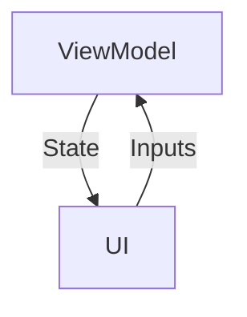
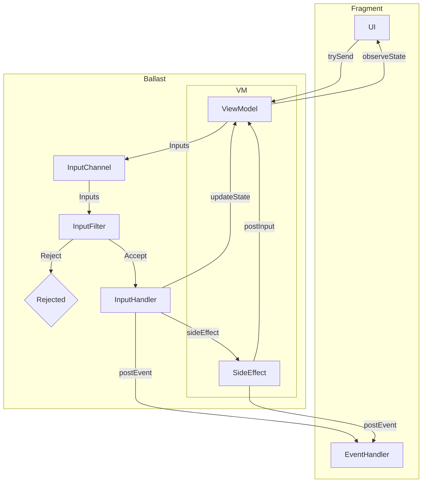

---
---

# Ballast Mental Model

## MVI/UDF Pattern

Ballast is a library implementing an opinionated structure of the MVI state management architecture pattern, based on 
the concept Unidirectional Data Flow. This pattern has been used and implemented by a variety of libraries across many
langauges and under a variety of names, such as Flux, Redux, Vuex, The Elm Architecture, etc. The idea behind all these
libraries is the sound and leads to clean UI architecture, and Ballast is just one particular way to do it.

The core idea is to model your UI not as discrete UI elements with click listeners, changing text, local state, etc. 
that all needs to be synced and updated manually, but instead to lift that state into a ViewModel, and update the entire
UI whenever the ViewModel state changes. This idea of "lifting state" naturally forms a loop in your UI, where:

- the **ViewModel** holds [**State**](#state), which gets pushed to the UI with every change
- the UI updates itself to match the current **State**
- The user interacts with the UI, producing [**Inputs**](#inputs), or their "intent" to change the UI state.
- The **Inputs** get sent back to the **ViewModel**, where it processes the **Inputs** to change the State

Notably, in this loop, the UI is never responsible for updating the **State** itself, and there is no business logic 
code that depends on any data held anywhere but the **State**. The UI only dispatches **Inputs** directing the ViewModel 
to update the state, and all processing is done within the **ViewModel**, asynchronously, and any changes to the 
**State** as a result of processing an **Input** will be pushed back to the UI automatically. You can visualize the loop 
like so:



This diagram is the simplest form of MVI, but Ballast adds a bit more structure and more features to this core loop, 
which are needed to build a fully-functional and _safe_ UI "state machine". Ballast itself is built around Kotlin 
[Coroutines](https://kotlinlang.org/docs/coroutines-overview.html), 
[Structured Concurrency](https://elizarov.medium.com/structured-concurrency-722d765aa952),
and [Flows](https://kotlinlang.org/docs/flow.html), though familiarity with them is not strictly necessary to use 
Ballast. Ballast was intentionally designed to be opinionated and "force" you to do the right thing, to help you avoid
many of the common issues that come with concurrent, asynchronous programming. A more complete diagram of the Ballast 
MVI model looks more like this:



The following sections walk you through the important terms in the Ballast framework and how they are specifically 
applied to Ballast's implmentation of the MVI pattern:

- [Inputs](#inputs)
- [State](#state)
- [Events](#events)
- [Side Effects](#side-effects)
- [Interceptors](#interceptors)

## Pitfalls of UI programming (and Ballast's approach to fixing them)

In normal UI programming, callbacks are typically executed in a single-threaded "event loop", which ensures only 1 
callback will be running and updating the UI state at a time. This generally works well, but things start getting ugly 
when those callbacks start other threads, coroutines, etc. and your callbacks start executing in parallel. This opens up
a high likelihood of race conditions and inconsistent UI states which get reported by users or crash reports, but are 
very difficult to debug. The "easy" solution to this is typically to just block the entire UI with a large, modal 
spinner, preventing any further UI interaction while work is running in the background. While this generally works to 
avoid the problems with concurrent programming, it leads to a poor user experience because if something is running in
the background, the user gets stuck and must wait for it to complete to do anything else. This is particularly annoying
when a user is simply navigating _between_ screens, but must still wait for each intermediate screen to finish loading
before moving to the next.

All that said, the core idea of an "event loop" is still generally a good idea, and Ballast takes that idea and, using
Kotlin Coroutines, builds an "input loop" that functions in a similar way, but allows that background work to be a core
part of the loop. The key to working with Ballast is understanding that it processes Inputs one at a time, in a 
suspending loop, where each Input may make background API calls or run work on other threads that cannot be done in the
normal UI "event loop".

But with Ballast running a suspending loop, it's natural that the user will continue to interact with the UI while some
work is still being processed in the background. Normal UI programming will either ignore these inputs or block the 
entire UI (making the user stuck on that screen while the work is running), or else run those new inputs in parallel to
what's already there (leading to race conditions and an inconsistent UI). Ballast exposes several more intelligent 
strategies for handling this use-case, when its "input loop" is suspended a new Input is received.

By default, Ballast assumes that when a user interacts with the UI, the UI should respond immediately. Thus, Ballast's
normal mode to processing Inputs is to cancel whatever is currently running, so that it can accept that new Input 
immediately. Alternatively, you may be running an API call that you don't want to get cancelled, and Ballast offers a
mechanism to set flags in the State which can be used to selectively ignore Inputs, or you may run those tasks in the
background so they do not block the Input Loop. These features are explaied in more detail below.


## Modeling a UI Contract 

The convention with Ballast is to use one Ballast ViewModel for each screen in your application, and to create a 
"contract" for interfacing your UI to the screen's ViewModel. Note that Ballast works well with Compose or other 
declarative UI frameworks, but the model will still hold true even with standard Android Views as long as you make sure 
to manually update the UI widgets' state to match the ViewModel state. Anyway, start by defining the "contract", for 
example, a login screen.

```kotlin
object LoginScreenContract { 
    data class State(
        ...
    )

    sealed class Inputs {
        ...
    }

    sealed class Events {
        ...
    }
}
```

Each Contract is a top-level `object` with a nested `State` `data class`, and `sealed class`es for `Inputs` and `Events`.

`State` is the persistent state of the ViewModel, which will get pushed to the UI anytime it changes. The UI should
update itself to display what's in that `State`, and in doing so will always be kept consistent with that State.

`Inputs` are how the UI communicates back to the ViewModel. Each discrete action in the UI, each click listener, text 
changed listener, etc. should be separate classes within the `Input` sealed class. Each `Inputs` subclass is should be
an `object` if the UI element doesn't directly deliver data to the ViewModel (a click listener), or a `data class` if 
it does need to deliver data (text changed). Don't worry about what to do with those yet, the Contract just defines the 
"what".

`Events` are modeled similar to Inputs, but in the other direction; Events are sent from the ViewModel to be processed 
exactly once by the UI. This would typically be things like requests to navigate to another screen.

Filling out the above contract for a Login Screen might end up looking like this:

```kotlin
object LoginScreenContract { 
    data class State(
        val username: TextFieldValue,
        val password: TextFieldValue,
    )

    sealed class Inputs {
        data class UsernameChanged(val newValue: TextFieldValue) : Inputs()
        data class PasswordChanged(val newValue: TextFieldValue) : Inputs()
        object LoginButtonClicked : Inputs()
        object RegisterButtonClicked : Inputs()
    }

    sealed class Events {
        object NavigateToDashboard : Events()
        object NavigateToRegistration : Events()
    }
}
```

## What Not to put in a UI Contract

Obviously, the initial thought when building out a Contract is to put every single variable into the State, and you 
absolutely can do that. But with sufficiently large screens, this may become a bit too verbose and introduce a lot of
back-and-forth jumping between the UI and the VM, which may not be strictly necessary. Assuming your entire UI, 
including its listeners, is updated with each state change, you can leave some amount of logic purely in the UI, and 
have the State and Inputs only model the things which are actually important from a business logic perspective.

As an example, let's take a Checkout screen. At the end of the flow, once the user has entered all their information, we
want to show a popup to confirm the user actually wants to submit the order to help prevent accidental clicks submitting 
it for them. If we had the logic for this popup in the Contract, it would look something like this in Jetpack Compose:

```kotlin
object CheckoutContract { 
    data class State(
        val cart: List<CartItem>,
        val isConfirmationDialogShowing: Boolean, // whether the popup should be open
    )

    sealed class Inputs {
        ...
        
        object CheckoutButtonClicked : Inputs() // open the popup
        object ConfirmationDialogCheckoutButtonClicked : Inputs() // submit the order
        object ConfirmationDialogCancelButtonClicked : Inputs() // close the popup
        object ConfirmationDialogDismissed : Inputs() // close the popup
    }

    sealed class Events {
        ...
    }
}

@Composable
fun Checkout(state: CheckoutContract.State, postInput: (CheckoutContract.Inputs)->Unit) { 
    ItemsInCard(state.cart)

    Button(onClick = { postInput(CheckoutContract.Inputs.CheckoutButtonClicked) }) {
        Text("Checkout")
    }

    if(state.isConfirmationDialogShowing) {
        AlertDialog(
            onDismissRequest = { 
                postInput(CheckoutContract.Inputs.ConfirmationDialogDismissed) 
            }, 
            text = { 
                Text("Submit order?") 
            },
            confirmButton = {
                Button(onClick = { postInput(CheckoutContract.Inputs.ConfirmationDialogCheckoutButtonClicked) }) { 
                    Text("Submit") 
                }
            },
            dismissButton = {
                Button(onClick = { postInput(CheckoutContract.Inputs.ConfirmationDialogCancelButtonClicked) }) {
                    Text("Cancel")
                }
            }
        )
    }
}
```

Now, there's nothing wrong with this, it's just a bit verbose. And looking at this snippet, it's not immediately obvious
that the purpose of all this code is just to show a confirmation dialog before submitting the order. It muddies up the 
actual intent and logic of this screen with a bunch of boilerplate, and since all of these events basically just toggles
a Boolean property, it's not really necessary to have all the structure and protections of Ballast managing it. A better
way to handle it is to leave the popup logic entirely in the UI and understand that popup to just be a UI detail, but
not something business-critical that needs to be modeled in the Contract:

```kotlin
object CheckoutContract { 
    data class State(
        val cart: List<CartItem>,
    )

    sealed class Inputs {
        ...
        
        object CheckoutButtonClicked : Inputs() // submit the order
    }

    sealed class Events {
        ...
    }
}

@Composable
fun Checkout(state: CheckoutContract.State, postInput: (CheckoutContract.Inputs)->Unit) { 
    ItemsInCard(state.cart)
    
    var isConfirmationDialogShowing by remember { mutableStateOf(isConfirmationDialogShowing) }

    Button(onClick = { isConfirmationDialogShowing = true }) {
        Text("Checkout")
    }

    if(isConfirmationDialogShowing) {
        AlertDialog(
            onDismissRequest = {
                isConfirmationDialogShowing = false 
            }, 
            text = {
                Text("Submit order?") 
            },
            confirmButton = {
                Button(onClick = { postInput(CheckoutContract.Inputs.CheckoutButtonClicked) }) { 
                    Text("Submit") 
                }
            },
            dismissButton = {
                Button(onClick = { isConfirmationDialogShowing = false }) {
                    Text("Cancel")
                }
            }
        )
    }
}
```

Notice how in this second snippet, it becomes more clear to see that clicking the main "Checkout" button does nothing 
dangerous, it only ever toggles a Boolean property. We can look at this code and know 100% for sure that the main 
"Checkout" button will never make the API call to submit the order. And it becomes easier to see exactly what point in 
the UI _does_ do something that could potentially trigger the API: hitting "submit" in the popup, since it's the only 
thing that posts an Input to the VM. We can also see from the Contract that submitting the order is the only truly 
important or potentially dangerous thing on this screen; anything else that _could_ happen is just UI stuff, but none of
those actions to show the dialog or do anything else have the ability to submit any API calls because they never go 
through the Ballast ViewModel.

Now, obviously, this is just an example. There may be perfectly legitimate use-cases for managing the state of a dialog
in the Contract, such as displaying the result of an API call in a popup. There are also other use-cases for managing 
variables in the UI and keeping them out of the Contract, such as disabling a submit button if a checkbox is not 
checked. The main point is that Ballast is a tool to _help_ you manage complex UIs as a state machine, but it does not 
need to house every single property. There is nuance to how you structure a Contract. It's supposed to make it easier
to read the code and understand what the UI is doing, and if it's getting bloated with a bunch of boilerplate inputs or 
state properties, you may want to take a step back and ask yourself whether something actually needs to be in the 
ViewModel or not.
