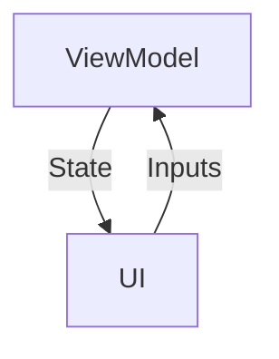
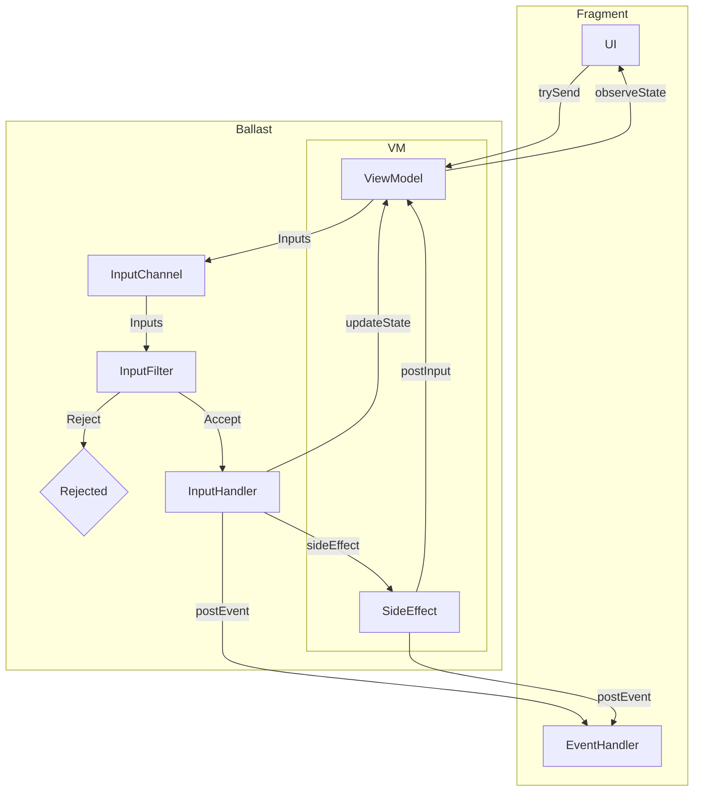

---
---

# Ballast Mental Model

## MVI/UDF Pattern

Ballast is a library implementing an opinionated structure of the MVI state management architecture pattern, based on 
the concept Unidirectional Data Flow. This pattern has been used and implemented by a variety of libraries across many
langauges and under a variety of names, such as Flux, Redux, Vuex, The Elm Architecture, etc. The idea behind all these
libraries is the sound and leads to clean UI architecture, and Ballast is just one particular way to do it.

The core idea is to model your UI not as discrete UI elements with click listeners, changing text, local state, etc. 
that all needs to be synced and updated manually, but instead to lift that state into a ViewModel, and update the entire
UI whenever the ViewModel state changes. This idea of "lifting state" naturally forms a loop in your UI, where:

- the **ViewModel** holds [**State**](#state), which gets pushed to the UI with every change
- the UI updates itself to match the current **State**
- The user interacts with the UI, producing [**Inputs**](#inputs), or their "intent" to change the UI state.
- The **Inputs** get sent back to the **ViewModel**, where it processes the **Inputs** to change the State

Notably, in this loop, the UI is never responsible for updating the **State** itself, and there is no business logic 
code that depends on any data held anywhere but the **State**. The UI only dispatches **Inputs** directing the ViewModel 
to update the state, and all processing is done within the **ViewModel**, asynchronously, and any changes to the 
**State** as a result of processing an **Input** will be pushed back to the UI automatically. You can visualize the loop 
like so:



This diagram is the simplest form of MVI, but Ballast adds a bit more structure and more features to this core loop, 
which are needed to build a fully-functional and _safe_ UI "state machine". Ballast itself is built around Kotlin 
[Coroutines](https://kotlinlang.org/docs/coroutines-overview.html), 
[Structured Concurrency](https://elizarov.medium.com/structured-concurrency-722d765aa952),
and [Flows](https://kotlinlang.org/docs/flow.html), though familiarity with them is not strictly necessary to use 
Ballast. Ballast was intentionally designed to be opinionated and "force" you to do the right thing, to help you avoid
many of the common issues that come with concurrent, asynchronous programming. A more complete diagram of the Ballast 
MVI model looks more like this:



The following sections walk you through the important terms in the Ballast framework and how they are specifically 
applied to Ballast's implmentation of the MVI pattern:

- [Inputs](#inputs)
- [State](#state)
- [Events](#events)
- [Side Effects](#side-effects)
- [Interceptors](#interceptors)

## Pitfalls of UI programming (and Ballast's approach to fixing them)

In normal UI programming, callbacks are typically executed in a single-threaded "event loop", which ensures only 1 
callback will be running and updating the UI state at a time. This generally works well, but things start getting ugly 
when those callbacks start other threads, coroutines, etc. and your callbacks start executing in parallel. This opens up
a high likelihood of race conditions and inconsistent UI states which get reported by users or crash reports, but are 
very difficult to debug. The "easy" solution to this is typically to just block the entire UI with a large, modal 
spinner, preventing any further UI interaction while work is running in the background. While this generally works to 
avoid the problems with concurrent programming, it leads to a poor user experience because if something is running in
the background, the user gets stuck and must wait for it to complete to do anything else. This is particularly annoying
when a user is simply navigating _between_ screens, but must still wait for each intermediate screen to finish loading
before moving to the next.

All that said, the core idea of an "event loop" is still generally a good idea, and Ballast takes that idea and, using
Kotlin Coroutines, builds an "input loop" that functions in a similar way, but allows that background work to be a core
part of the loop. The key to working with Ballast is understanding that it processes Inputs one at a time, in a 
suspending loop, where each Input may make background API calls or run work on other threads that cannot be done in the
normal UI "event loop".

But with Ballast running a suspending loop, it's natural that the user will continue to interact with the UI while some
work is still being processed in the background. Normal UI programming will either ignore these inputs or block the 
entire UI (making the user stuck on that screen while the work is running), or else run those new inputs in parallel to
what's already there (leading to race conditions and an inconsistent UI). Ballast exposes several more intelligent 
strategies for handling this use-case, when its "input loop" is suspended a new Input is received.

By default, Ballast assumes that when a user interacts with the UI, the UI should respond immediately. Thus, Ballast's
normal mode to processing Inputs is to cancel whatever is currently running, so that it can accept that new Input 
immediately. Alternatively, you may be running an API call that you don't want to get cancelled, and Ballast offers a
mechanism to set flags in the State which can be used to selectively ignore Inputs, or you may run those tasks in the
background so they do not block the Input Loop. These features are explaied in more detail below.

## UI Contract

### Modeling a UI Contract 

The convention with Ballast is to use one Ballast ViewModel for each screen in your application, and to create a 
"contract" for interfacing your UI to the screen's ViewModel. Note that Ballast works well with Compose or other 
declarative UI frameworks, but the model will still hold true even with standard Android Views as long as you make sure 
to manually update the UI widgets' state to match the ViewModel state. Anyway, start by defining the "contract", for 
example, a login screen.

```kotlin
object LoginScreenContract { 
    data class State(
        ...
    )

    sealed class Inputs {
        ...
    }

    sealed class Events {
        ...
    }
}
```

Each Contract is a top-level `object` with a nested `State` `data class`, and `sealed class`es for `Inputs` and `Events`.

`State` is the persistent state of the ViewModel, which will get pushed to the UI anytime it changes. The UI should
update itself to display what's in that `State`, and in doing so will always be kept consistent with that State.

`Inputs` are how the UI communicates back to the ViewModel. Each discrete action in the UI, each click listener, text 
changed listener, etc. should be separate classes within the `Input` sealed class. Each `Inputs` subclass is should be
an `object` if the UI element doesn't directly deliver data to the ViewModel (a click listener), or a `data class` if 
it does need to deliver data (text changed). Don't worry about what to do with those yet, the Contract just defines the 
"what".

`Events` are modeled similar to Inputs, but in the other direction; Events are sent from the ViewModel to be processed 
exactly once by the UI. This would typically be things like requests to navigate to another screen.

Filling out the above contract for a Login Screen might end up looking like this:

```kotlin
object LoginScreenContract { 
    data class State(
        val username: TextFieldValue,
        val password: TextFieldValue,
    )

    sealed class Inputs {
        data class UsernameChanged(val newValue: TextFieldValue) : Inputs()
        data class PasswordChanged(val newValue: TextFieldValue) : Inputs()
        object LoginButtonClicked : Inputs()
        object RegisterButtonClicked : Inputs()
    }

    sealed class Events {
        object NavigateToDashboard : Events()
        object NavigateToRegistration : Events()
    }
}
```

### What Not to put in a UI Contract

Obviously, the initial thought when building out a Contract is to put every single variable into the State, and you 
absolutely can do that. But with sufficiently large screens, this may become a bit too verbose and introduce a lot of
back-and-forth jumping between the UI and the VM, which may not be strictly necessary. Assuming your entire UI, 
including its listeners, is updated with each state change, you can leave some amount of logic purely in the UI, and 
have the State and Inputs only model the things which are actually important from a business logic perspective.

As an example, let's take a Checkout screen. At the end of the flow, once the user has entered all their information, we
want to show a popup to confirm the user actually wants to submit the order to help prevent accidental clicks submitting 
it for them. If we had the logic for this popup in the Contract, it would look something like this in Jetpack Compose:

```kotlin
object CheckoutContract { 
    data class State(
        val cart: List<CartItem>,
        val isConfirmationDialogShowing: Boolean, // whether the popup should be open
    )

    sealed class Inputs {
        ...
        
        object CheckoutButtonClicked : Inputs() // open the popup
        object ConfirmationDialogCheckoutButtonClicked : Inputs() // submit the order
        object ConfirmationDialogCancelButtonClicked : Inputs() // close the popup
        object ConfirmationDialogDismissed : Inputs() // close the popup
    }

    sealed class Events {
        ...
    }
}

@Composable
fun Checkout(state: CheckoutContract.State, postInput: (CheckoutContract.Inputs)->Unit) { 
    ItemsInCard(state.cart)

    Button(onClick = { postInput(CheckoutContract.Inputs.CheckoutButtonClicked) }) {
        Text("Checkout")
    }

    if(state.isConfirmationDialogShowing) {
        AlertDialog(
            onDismissRequest = { 
                postInput(CheckoutContract.Inputs.ConfirmationDialogDismissed) 
            }, 
            text = { 
                Text("Submit order?") 
            },
            confirmButton = {
                Button(onClick = { postInput(CheckoutContract.Inputs.ConfirmationDialogCheckoutButtonClicked) }) { 
                    Text("Submit") 
                }
            },
            dismissButton = {
                Button(onClick = { postInput(CheckoutContract.Inputs.ConfirmationDialogCancelButtonClicked) }) {
                    Text("Cancel")
                }
            }
        )
    }
}
```

Now, there's nothing wrong with this, it's just a bit verbose. And looking at this snippet, it's not immediately obvious
that the purpose of all this code is just to show a confirmation dialog before submitting the order. It muddies up the 
actual intent and logic of this screen with a bunch of boilerplate, and since all of these events basically just toggles
a Boolean property, it's not really necessary to have all the structure and protections of Ballast managing it. A better
way to handle it is to leave the popup logic entirely in the UI and understand that popup to just be a UI detail, but
not something business-critical that needs to be modeled in the Contract:

```kotlin
object CheckoutContract { 
    data class State(
        val cart: List<CartItem>,
    )

    sealed class Inputs {
        ...
        
        object CheckoutButtonClicked : Inputs() // submit the order
    }

    sealed class Events {
        ...
    }
}

@Composable
fun Checkout(state: CheckoutContract.State, postInput: (CheckoutContract.Inputs)->Unit) { 
    ItemsInCard(state.cart)
    
    var isConfirmationDialogShowing by remember { mutableStateOf(isConfirmationDialogShowing) }

    Button(onClick = { isConfirmationDialogShowing = true }) {
        Text("Checkout")
    }

    if(isConfirmationDialogShowing) {
        AlertDialog(
            onDismissRequest = {
                isConfirmationDialogShowing = false 
            }, 
            text = {
                Text("Submit order?") 
            },
            confirmButton = {
                Button(onClick = { postInput(CheckoutContract.Inputs.CheckoutButtonClicked) }) { 
                    Text("Submit") 
                }
            },
            dismissButton = {
                Button(onClick = { isConfirmationDialogShowing = false }) {
                    Text("Cancel")
                }
            }
        )
    }
}
```

Notice how in this second snippet, it becomes more clear to see that clicking the main "Checkout" button does nothing 
dangerous, it only ever toggles a Boolean property. We can look at this code and know 100% for sure that the main 
"Checkout" button will never make the API call to submit the order. And it becomes easier to see exactly what point in 
the UI _does_ do something that could potentially trigger the API: hitting "submit" in the popup, since it's the only 
thing that posts an Input to the VM. We can also see from the Contract that submitting the order is the only truly 
important or potentially dangerous thing on this screen; anything else that _could_ happen is just UI stuff, but none of
those actions to show the dialog or do anything else have the ability to submit any API calls because they never go 
through the Ballast ViewModel.

Now, obviously, this is just an example. There may be perfectly legitimate use-cases for managing the state of a dialog
in the Contract, such as displaying the result of an API call in a popup. There are also other use-cases for managing 
variables in the UI and keeping them out of the Contract, such as disabling a submit button if a checkbox is not 
checked. The main point is that Ballast is a tool to _help_ you manage complex UIs as a state machine, but it does not 
need to house every single property. There is nuance to how you structure a Contract. It's supposed to make it easier
to read the code and understand what the UI is doing, and if it's getting bloated with a bunch of boilerplate inputs or 
state properties, you may want to take a step back and ask yourself whether something actually needs to be in the 
ViewModel or not.

## Async Logic

How to handle async logic within Ballast depends a bit on your specific needs, and will impact how Ballast requires you
to write your code so that it is always handled safely. When working with Ballast, it is important to keep the following
2 rules in mind:

1. Only 1 Input will be processed at any given time
2. Inputs are processed in parallel to the UI, not synchronously. So a new Input may be dispatched to the ViewModel 
  while one is still running

Ballast has several strategies to enforce these 2 rules and ensure they are well-behaved, or even allows you to customize
its behavior to break the rules. But it's important to keep in mind these 2 rules and make sure you understand the 
consequences of breaking them. Let's break these rules down and understand how they impact your app, by considering the
following example:

We have 2 Inputs which load data from a remote API. Each Input sets `loading` to true until the API call returns, then
sets it back to false along with its results. Individually, each Input is perfectly well-behaved, but things start to go 
wrong when we try to send both Inputs at the same time.

```kotlin
suspend fun InputHandlerScope<Inputs, Events, State>.handleInput(input: Inputs) = when(input) { 
    is Inputs.LoadPosts -> { 
        updateState { it.copy(loading = true) }
        val posts = postsRepository.getPosts() // suspending function, takes 2 seconds
        updateState { it.copy(loading = false, posts = posts) }
    }
    is Inputs.LoadLatestPostContent -> {
        updateState { it.copy(loading = true) }
        val latestPost = postsRepository.getLatestPost() // suspending function, takes 1 second
        updateState { it.copy(loading = false, latestPost = latestPost) }
    }
}

viewModel.trySend(Inputs.LoadPosts)
viewModel.trySend(Inputs.LoadLatestPostContent)
```

If we consider the user's perspective, they should see a progress indicator displayed for 2 seconds, because that's how
long it takes to load the posts. The latest post loads more quickly than that, so we'd expect to display the progress
indicator for as long as anything is still loading.

But with this implementation, if we sent both Inputs at the same time and allowed them to run in parallel, the progress 
indicator would be dismissed after only 1 second, and 1 second after that the user would see an unpleasant "jank" as the
list of posts arrived unexpectedly.

The following are some strategies we could employ to provide a better UX to the user, with their pros and cons

### Queue up the Inputs and run them 1 at a time

The first thing we could do is to make sure that only 1 Input is executing at a time. This would ensure no race 
conditions are possible from interleaved code, but it would also mean that this snippet now takes 3 seconds to complete, 
instead of 2. It also leaves a tiny amount of time between when `LoadPosts` finished as sets `loading` to `false`, and 
when `LoadLatestPostContent` starts and sets it back to true. If the device is fast enough, the user might not notice, 
but slower devices may result in the progress indicator being briefly dismissed, then shown again.

This works to prevent the race conditions, but it introduces another problem: if the user doesn't actually want to see
these posts, and instead was just passing through this screen to get to another, they are stuck waiting for the whole
thing to load anyway. Because the Inputs get queued up, the user's request to move to another screen will wait for the
first two to complete before actually processing the navigation request. Obviously, this is not a great UX, and may 
leave the user frustrated with the slowness of the app.

### Cancel Inputs so only the latest 1 is running at a time

So we see that having only 1 Input run at a time is good, but the "blocking" queue is not. So instead, why don't we try
only processing the latest Input we receive at any given time? With Kotlin flows, this is done with the `.mapLatest { }`
operator, and actually is the default strategy Ballast uses (though it can be changed).

When using `.mapLatest { }`, if the UI is loading some data and the user requests to navigate away, the API calls will 
be cancelled before they finish, so that Ballast can accept the latest Input and handle the navigation request 
immediately. 

But this is not without its drawbacks either. Since we sent both "initial" Inputs at the same time, the second one will
immediately cancel the first. The result is a progress indicator that only displays for 1 second, and we load the latest
post content but never get the full list of posts from the first Input. While this strategy does provide the best 
experience to the user, it can be subtly confusing for developers, which is why it's best to structure your app such 
that you don't encounter this situation.

### Use a single "Initialize" Input to perform all long-running operations

One way to restructure your Inputs to avoid accidental cancellation is to move all long-running "fetch" operations into 
a single Input, canonically called `Initialize`, and sending that 1 event when the screen starts instead of multiple for
individual resources.

```kotlin
suspend fun InputHandlerScope<Inputs, Events, State>.handleInput(input: Inputs) = when(input) { 
    is Inputs.Initialize -> {
        coroutineScope { 
            updateState { it.copy(loading = true) }
            val deferredPosts = async { postsRepository.getPosts() } // suspending function, takes 2 seconds
            val deferredLatestPost = async { postsRepository.getLatestPost() } // suspending function, takes 1 second
            updateState { it.copy(loading = false, posts = deferredPosts.await(), latestPost = deferredLatestPost.await()) }
        }
    }
}

viewModel.trySend(Inputs.Initialize)
```

So far, this is definitely the best way to handle this logic. Since we're using coroutines, we can run the fetching 
operations each in parallel with `async { ... }.await()`, and set a single `loading` flag that works for both endpoints.
The result is both data sources are loaded, the progress indicator is visible for 2 seconds, and if the user navigates 
away these API calls will be cancelled and the navigation performed immediately.

This is the preferred pattern for loading data asynchronously in Ballast. But there are a few other use-cases that we'll
consider in a later section.

## Side Effects

The above section on Async Logic works when you have individual "resources" you are loading, and are reasonably sure the
only way it could get cancelled is if the user intends for it to be cancelled, such as by navigating to another screen 
where we do not need those resources.

But real-world applications aren't always that simple. One use-case is observing a stream of events (a Kotlin `Flow`) of
some data source, rather than a discrete suspending value. For example, rather than the respository directly delivering
the results of an API call, it may cache it, and send multiple emissions to notify of the cache status (see 
{{ 'Repository' | anchor }} module). Or you connect to the phone's GPS and receive an endless stream of GPS coordinates
you need to display on a map. We need a new strategy to handle this kind of use-case: a "side effect".

Until this point, we've been working with the notion that the InputHandler will suspend until the async work completes, 
and we considered what would happen if a new Input arrived while one was already suspended. But if we have a 
potentially-infinite data source, we obviously cannot connect to that directly within the InputHandler. Similarly, maybe
we have a situation where it's not feasible to move all initialization logic into a single Input, but we still want to
load from multiple APIs in parallel. Both these can be accomplished by moving that work into a `sideEffect { }` block.

Side effects work kind-of like a "thunk" in Redux; they move async logic outside of the normal data flow of the 
ViewModel, running fully parallel to it, but provide a handle back to the ViewModel where it can post one or more 
additional Inputs with the results of its data. Since they're running parallel to the ViewModel, we cannot allow a 
sideEffect to modify the `State`, otherwise we'd run into the same problem we had initially, so instead it needs to just
send requests back into the proper Input stream to be processed as any other Input, applying the results to the state 
when they are processed themselves.

### Basic Side Effect Usage

Rewriting the original snippet to load both posts in a sideEffect would look like this:

```kotlin
suspend fun InputHandlerScope<Inputs, Events, State>.handleInput(input: Inputs) = when(input) {
    is Inputs.PostsLoaded -> { updateState { it.copy(posts = input.posts) } }
    is Inputs.LatestPostContentLoaded -> { updateState { it.copy(latestPost = input.latestPost) } }
    is Inputs.LoadPosts -> { 
        sideEffect {
            val posts = postsRepository.getPosts() // suspending function, takes 2 seconds
            postInput(Inputs.PostsLoaded(posts))
        }
    }
    is Inputs.LoadLatestPostContent -> {
        sideEffect {
            val latestPost = postsRepository.getLatestPost() // suspending function, takes 1 second
            postInput(Inputs.LatestPostContentLoaded(latestPost))
        }
    }
}

viewModel.trySend(Inputs.LoadPosts)
viewModel.trySend(Inputs.LoadLatestPostContent)
```

(I've gone ahead and removed the `loading` flag from these examples, as they will just get in the way of the intent of 
these snippets from here on out.)

This snippet _almost_ works, but it's ignoring a small, but very important detail of sideEffects: they are restartable.
The lifecycle of each `sideEffect { }` block still needs to be managed by Ballast, cancelled when the ViewModel is 
cancelled. However, since MVI is a declarative design pattern, it's reasonable to assume that one could "force a 
refresh" simply by sending the same Input back to Ballast. With normal Input processing rules, that would cancel the 
current Input and run the new one. But sideEffects break out of that cycle, and so Ballast requires each sideEffect to
have a different "key". If any Input tries to launch a sideEffect with the same key, the old sideEffect will be 
cancelled to accept the new one. This prevents multiple instances of the same block of code being run all in parallel if
the same Input is sent multiple times.

So the fix is to just provide a key to the `sideEffect` function:

```kotlin
suspend fun InputHandlerScope<Inputs, Events, State>.handleInput(input: Inputs) = when(input) {
    is Inputs.PostsLoaded -> { updateState { it.copy(posts = input.posts) } }
    is Inputs.LatestPostContentLoaded -> { updateState { it.copy(latestPost = input.latestPost) } }
    is Inputs.LoadPosts -> { 
        sideEffect("LoadPosts") {
            val posts = postsRepository.getPosts() // suspending function, takes 2 seconds
            postInput(Inputs.PostsLoaded(posts))
        }
    }
    is Inputs.LoadLatestPostContent -> {
        sideEffect("LoadPosts") {
            val latestPost = postsRepository.getLatestPost() // suspending function, takes 1 second
            postInput(Inputs.LatestPostContentLoaded(latestPost))
        }
    }
}

viewModel.trySend(Inputs.LoadPosts)
viewModel.trySend(Inputs.LoadLatestPostContent)

refreshButton.setOnClickListener {
    viewModel.trySend(Inputs.LoadPosts)
    viewModel.trySend(Inputs.LoadLatestPostContent)
}
```

### Observing Flows

Now that we have a basic idea of sideEffects, let's apply it to the use-case of observing GPS coordinates from your 
phone's sensor. Since sideEffects do not block the normal Input stream, there's nothing wrong with observing an infinite
stream of events in it, so it becomes a simple matter of collecting from the `Flow` and posting all those changes back
to the ViewModel.

```kotlin
suspend fun InputHandlerScope<Inputs, Events, State>.handleInput(input: Inputs) = when(input) {
    is Inputs.GpsCoordinatesUpdated -> { updateState { it.copy(coordinates = input.coordinates) } }
    is Inputs.ObserveGpsSignal -> { 
        sideEffect("ObserveGpsSignal") {
            coroutineScope {
                gpsRepository
                    .observeLocation() // returns a Flow
                    .map { Inputs.GpsCoordinatesUpdated(it) }
                    .onEach { postInput(it) }
                    .launchIn(this)
            }
        }
    }
}

viewModel.trySend(Inputs.ObserveGpsSignal)
```

As this is one of the main use-cases for sideEffects, and Ballast offers a convenient shorthand for you:

```kotlin
suspend fun InputHandlerScope<Inputs, Events, State>.handleInput(input: Inputs) = when(input) {
    is Inputs.GpsCoordinatesUpdated -> { updateState { it.copy(coordinates = input.coordinates) } }
    is Inputs.ObserveGpsSignal -> {
        observeFlows(
            gpsRepository
                .observeLocation() // returns a Flow
                .map { Inputs.GpsCoordinatesUpdated(it) },
            key = "ObserveGpsSignal"
        )
    }
}

viewModel.trySend(Inputs.ObserveGpsSignal)
```

### Sending Follow-up Inputs

One final use-case for sideEffects that I haven't yet touched on is sending Inputs, without any further logic.

Consider a pub-sub type architecture, where one Input needs to do some processing, and then dispatch another Input after
it has finished. Attempting to send a new Input directly from another Input is bad for 2 potential reasons: immediate
cancellation, or deadlock.

The most likely scenario is that the Input Channel to the ViewModel is buffered. If we allowed an Input to directly send
another Input, then it will immediately get accepted, and thus cancel the current (sending) Input. But if the Channel 
was configured to be `RENDEZVOUS` and running in a single-threaded coroutineContext, then the sender would suspend until 
that Input is read from the channel, but the ViewModel will not able to receive the Input from that channel until the 
sender has finished, which is a deadlock. These are both hypothetical scenarios, but the danger is certainly there, 
which is why Ballast simply forbids sending an Input directly from another Input. Instead, Inputs can only be sent back 
to the ViewModel from a sideEffect or an Event.

```kotlin
suspend fun InputHandlerScope<Inputs, Events, State>.handleInput(input: Inputs) = when(input) {
    is Inputs.RequestLogout -> {
        loginRepository.logOut()
        sideEffect("RequestLogOut") {
            postInput(Inputs.ClearCache)
        }
    }
    is Inputs.ClearCache -> {
        updateState { it.copy(user = null) }
    }
}

viewModel.trySend(Inputs.RequestLogout)
```

Like `observeFlows`, this too, has a convenient helper method which makes it look like you are sending an Input directly
from another Input, but is in fact sending it from a sideEffect block. Since it's a simple sideEffect, it will also 
derive a key for you based on the Input (it's `.toString()`), so that calling `postInput()` does not accidentally cancel 
any other sideEffects.

```kotlin
suspend fun InputHandlerScope<Inputs, Events, State>.handleInput(input: Inputs) = when(input) {
    is Inputs.RequestLogout -> {
        loginRepository.logOut()
        postInput(Inputs.ClearCache)
    }
    is Inputs.ClearCache -> {
        updateState { it.copy(user = null) }
    }
}

viewModel.trySend(Inputs.RequestLogout)
```

