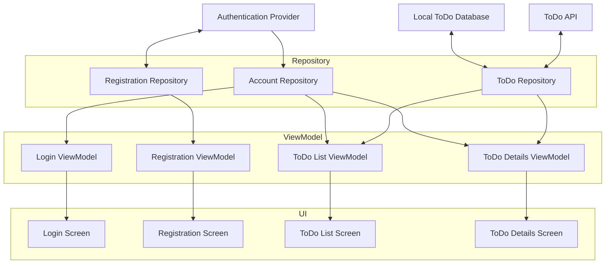

---
---

# Usage Guide

Ballast is an opinionated library, and it was carefully designed to give you a standard workflow for all types of 
screens or components in your application, and on any platform. 

Each platform will have some of its own special setup that may be needed, but the general workflow will be the same, as
outlined here. This guide will cover the basics of getting set up and productive with Ballast, and will try to avoid
any platform-specific functionality. Refer to each individual [Platform][1] for further instructions necessary for that
platform.

## Project Structure and Architecture

Ballast generally works best as part of a layered architecture, consisting of the following layers:

### UI

At the UI layer, you will have things broken up into Screens or Components per your own requirements, and these UI 
pieces should be a "reactive" UI. This basically means that the entire UI for that screen is driven from a State object, 
and the entire UI is updated whenever any part of the State changes. Frameworks like Compose or React were obviously
built to apply these updates efficiently, but non-reactive UI frameworks can be adapted to this pattern fairly easily.

Note that "screens" is primarily referring to a Mobile form-factor, while "components" refers more to Desktop or Web. 
Also a "component" as used in this guide would be a bigger, more complex chunk of UI than just a React component, for 
example. Think of components basically as a small portion of the entire Web/Desktop screen that is basically its own
feature, such as a data table with all the filtering capabilities, or a tool window in an IDE, something that would 
basically need to be its own screen on a mobile device.

### ViewModel

Since each screen/component is reactive and driven by a State, you need something to manage that State, which we call a
ViewModel. The purpose of the ViewModel is to live _at least_ as long as the Screen (potentially longer depending on 
platform implementation), and be the class to hold and update the State, dispatching changes back to the UI. 

There should be a 1-to-1 relationship between screens and ViewModels. Each screen should really only be observing a 
single ViewModel, and each ViewModel should not be shared between different screens. If data should be shared between
multiple screens/components it should either be passed from one to the other during navigation, or else managed in the
Repository layer and observed from both screen's ViewModels.

This is the layer that Ballast was primarily designed to implement.

### Repository

The data stored in each screen's ViewModel is really just the local state for that screen, divorced from any persistent
application state. It only knows what is directly needed for that one screen, but there will be a lot of data needed in
an application than just what is visible on the screen. For example, account session tokens, profile information, user
preferences, and other data like that will necessarily live much longer than a single screen, and likely needs to be 
shared among different screens, potentially at the same time.

The Repository layer's job is to manage all that data and expose a clean interface to the ViewModels that abstracts away
the complexity of those underlying data sources. The Repository layer shouldn't expose database or API models directly 
to the ViewModel, because those structures are likely to change or use "unsafe" values. Instead, it should map those
models to safer ones that are easier to work with in the UI, and isolates the UI from changes to the API or database 
structure.

By its nature, the Repository layer can be a bit precarious to work on, because one change can affect many parts of your
application. It's also almost entirely an exercise in caching, which we all know is a [hard problem][3]. Traditionally, 
the libraries and code that implemented the repository layer was very different from the ViewModel layer, but Ballast's 
[Repository module][2] allows you to use the same mental model for building both, reducing the difficulty of 
context-switching and making the repository layer less intimidating.

### Final Thoughts on Architecture

You'll notice that this layering does not describe any kind of "API layer" or "Database layer", and that is intentional.
It's best to think of those not as discrete layers, but rather just as data sources that are exposed through the 
Repository layer. If you think of the API or Database as a "layer", you will naturally want to conform your application
to the structure of those, which will cause problems if there are any major changes needed in them. Instead, just build
your app using models you define that are easy to work with, and use the Repository layer to conform the API to the 
structure of your application. 

And finally, here's a diagram showing an example application designed with this architecture. Consider a basic TODO app
that users must log-in to use.

## Ballast Workflow

### Define a Contract

The first step for using Ballast on any screen is to define the Contract. The Contract 

### Write the InputHandler

### Connect to the Platform UI

## Dependency Injection

## Lifecycles

[1]: {{ 'Platforms' | link }}
[2]: {{ 'Ballast Repository' | link }}
[3]: https://martinfowler.com/bliki/TwoHardThings.html
[4]: http://localhost:8080/wiki/mental-model#ui-contract
