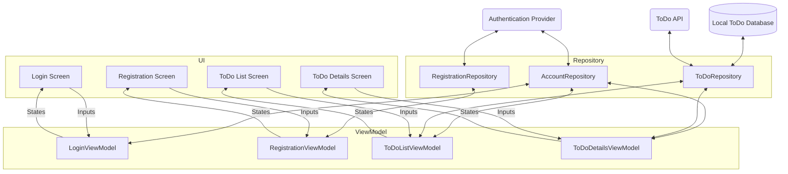

---
---

# Project Architecture

## Architectural Layering

Ballast generally works best as part of a layered architecture, consisting of the following layers:

### UI

At the UI layer, you will have things broken up into Screens or Components per your own requirements, and these UI 
pieces should be a "reactive" UI. This basically means that the entire UI for that screen is driven from a State object, 
and the entire UI is updated whenever any part of the State changes. Frameworks like Compose or React were obviously
built to apply these updates efficiently, but non-reactive UI frameworks can be adapted to this pattern fairly easily, 
so using a "reactive UI framework" is not necessary to use Ballast.

Note that "screens" is primarily referring to a Mobile form-factor, while "components" refers more to Desktop or Web. 
Also a "component" as used in this guide would be a bigger, more complex chunk of UI than just a React component, for 
example. Think of components basically as a small portion of the entire Web/Desktop screen that is basically its own
feature, such as a data table with all the filtering capabilities or a tool panel in an IDE, something that would 
basically need to be its own screen on a mobile device.

### ViewModel

Since each screen/component is reactive and driven by a State, you need something to manage that State, which we call a
ViewModel. The purpose of the ViewModel is to live _at least_ as long as the Screen (potentially longer depending on 
platform implementation), and be the class to hold and update the State, dispatching changes back to the UI. 

There should be a 1-to-1 relationship between screens and ViewModels. Each screen should really only be observing a 
single ViewModel, and each ViewModel should not be shared between different screens. If data should be shared between
multiple screens/components it should either be passed from one to the other during navigation, or else managed in the
Repository layer and observed from both screen's ViewModels.

This is the layer that Ballast was primarily designed to implement.

### Repository

The data stored in each screen's ViewModel is really just the local state for that screen, divorced from any persistent
application state. It only knows what is directly needed for that one screen, but there will be a lot more data needed 
in an application than just what is visible on the screen. For example, account session tokens, profile information, 
user preferences, and other data like that will necessarily live much longer than a single screen, and likely needs to 
be shared among different screens (potentially at the same time).

The Repository layer's job is to manage all that data and expose a clean interface to the ViewModels that abstracts away
the complexity of those underlying data sources. The Repository layer shouldn't expose database or API models directly 
to the ViewModel, because those structures are likely to change or use "unsafe" values (nulls, 
[stringly-typed values][6], etc). Instead, it should map those models to safer ones that are easier to work with in the
UI (by parsing Strings into the proper enums, providing default values for nulls, etc.), thereby isolating the UI from
changes to the API or database structure.

By its nature, the Repository layer can be a bit precarious to work on, because one change can affect many parts of your
application. It's also largely an exercise in caching, which we all know is a [hard problem][3]. Traditionally, the
libraries and code that implemented the repository layer was very different from the ViewModel layer, but Ballast's 
[Repository module][2] allows you to use the same mental model for building both, reducing the difficulty of 
context-switching and making the repository layer less intimidating and easier to understand and work with.

### Final Thoughts on Architecture

You'll notice that this layering does not describe any kind of "API layer" or "Database layer", and that is intentional.
It's best to think of those not as discrete layers, but rather just as data sources that are exposed through the 
Repository layer. If you think of the API or Database as a "layer", you will naturally want to conform your application
to the structure of those, which will cause problems if there are any major changes needed in them later on. Instead, 
just build your app using models you define that are easy to work with, and use the Repository layer to conform the API
to the structure of your application. 

And finally, here's a diagram showing an example application designed with this architecture. Consider a basic TODO app
that users must log-in to use.



[1]: {{ 'Platforms' | link }}
[2]: {{ 'Ballast Repository' | link }}
[3]: https://martinfowler.com/bliki/TwoHardThings.html
[4]: http://localhost:8080/wiki/mental-model#ui-contract
[5]: {{ 'Android' | link }}
[6]: https://wiki.c2.com/?StringlyTyped
[7]: {{ 'Examples' | link }}
[8]: {{ 'Ballast Intellij Plugin' | link }}

## Dependency Injection

Most apps will use some kind of DI, and Ballast is set up very well to provide all the necessary pieces via DI. Some of
the classes, especially the InputHandler, can typically be provided in common code, but other classes, like the
ViewModel or EventHandler, must be provided in the platform-specific modules.

The best way to save time and LOC with DI is to provide a common definition of `BallastViewModelConfiguration.Builder`
with the configuration common to all ViewModels (the Logging and Debugger Interceptors, for example), and then using
that common builder to create the actual configuration for each ViewModel. Rewriting the ViewModel class to be setup
with DI might look something like this:

```kotlin
class LoginScreenViewModel(
    config: BallastViewModelConfiguration<
        LoginScreenContract.Inputs,
        LoginScreenContract.Events,
        LoginScreenContract.State>,
) : AndroidViewModel<
    LoginScreenContract.Inputs,
    LoginScreenContract.Events,
    LoginScreenContract.State>(
    config = config
)
```

Using Koin on Android, the DI might look like this:

```kotlin
val platformModule = module {
    factory<LoginApi> {
        LoginApiImpl()
    }
    single<LoginRepository> {
        LoginRepositoryImpl(
            loginApi = get()
        )
    }
    factory<BallastViewModelConfiguration.Builder> {
        BallastViewModelConfiguration.Builder()
            .apply {
                this += LoggingInterceptor()
                logger = { AndroidBallastLogger(it) }
            }
    }
    factory<LoginScreenInputHandler> {
        LoginScreenInputHandler(
            loginRepository = get()
        )
    }
    viewModel<LoginScreenViewModel> { 
        LoginScreenViewModel(
            config = get<BallastViewModelConfiguration.Builder>()
                .withViewModel(
                    initialState = LoginScreenContract.State(),
                    inputHandler = get<LoginScreenInputHandler>(),
                    name = "LoginScreen",
                )
                .build(),
        ) 
    }
}

class LoginActivity : AppCompatActivity(), KoinComponent {
    private val viewModel: LoginScreenViewModel by viewModel()
}
```

For some platforms, you will need to provide parameters from the UI when accessing the ViewModel instance, such as a
`CoroutineScope`. This is done through assisted injection. Again using Koin, this is what this would look like for JS:

```kotlin
val platformModule = module {
    factory<LoginApi> {
        LoginApiImpl()
    }
    single<LoginRepository> {
        LoginRepositoryImpl(
            loginApi = get()
        )
    }
    factory<BallastViewModelConfiguration.Builder> {
        BallastViewModelConfiguration.Builder()
            .apply {
                this += LoggingInterceptor()
                logger = { JsConsoleBallastLogger(it) }
            }
    }
    factory<LoginScreenInputHandler> {
        LoginScreenInputHandler(
            loginRepository = get()
        )
    }
    factory<LoginScreenViewModel> { (coroutineScope: CoroutineScope) ->
        LoginScreenViewModel(
            config = get<BallastViewModelConfiguration.Builder>()
                .withViewModel(
                    initialState = LoginScreenContract.State(),
                    inputHandler = get<LoginScreenInputHandler>(),
                    name = "LoginScreen",
                )
                .build(),
        ) 
    }
}

class LoginPage : KoinComponent {
    @Composable
    fun LoginContent() {
        val viewModelScope = rememberCoroutineScope()
        val viewModel: LoginScreenViewModel = remember(viewModelScope) { get { parametersOf(viewModelScope) } }
    }
}
```

Of course, it is possible to use Ballast with any other DI tool out there as well, such as Dagger/Hilt, Kodein, or even
hand-written DI. The process for using any of those options will be very similar, just using that tool's specific DSL
for providing and accessing instances of each class.

## Folder Structure

It's best to structure your applications such that each screen is in its own subfolder of `ui/`, which contains all of
the relevant classes for both Ballast and the UI. Likewise, each Repository should be in its own folder of
`repository/`.

For example, in a pure-Android application, the [four examples][7] would
be structured like this:

```
app/
└── src/main/kotlin/
    ├── api/
    │   └── bgg/
    │       └── BggApi.kt
    ├── repository/
    │   └── bgg/
    │       ├── BggRepository.kt
    │       ├── BggRepositoryImpl.kt
    │       ├── BggRepositoryContract.kt
    │       └── BggRepositoryInputHandler.kt
    ├── ui/
    │   ├── counter/
    │   │   ├── CounterContract.kt
    │   │   ├── CounterInputHandler.kt
    │   │   ├── CounterEventHandler.kt
    │   │   ├── CounterViewModel.kt
    │   │   └── CounterFragment.kt
    │   ├── scorekeeper/
    │   │   ├── ScorekeeperContract.kt
    │   │   ├── ScorekeeperInputHandler.kt
    │   │   ├── ScorekeeperEventHandler.kt
    │   │   ├── ScorekeeperViewModel.kt
    │   │   └── ScorekeeperFragment.kt
    │   ├── bgg/
    │   │   ├── BggContract.kt
    │   │   ├── BggInputHandler.kt
    │   │   ├── BggEventHandler.kt
    │   │   ├── BggViewModel.kt
    │   │   └── BggFragment.kt
    │   └── kitchensink/
    │       ├── KitchenSinkContract.kt
    │       ├── KitchenSinkInputHandler.kt
    │       ├── KitchenSinkEventHandler.kt
    │       ├── KitchenSinkViewModel.kt
    │       └── KitchenSinkFragment.kt
    ├── MainApplication.kt
    └── MainActivity.kt
```

When using Ballast in a multiplatform app, the folder structure will not change, but you will have some of those classes
moved between the different sourceSets, as needed for each platform.

```
app/
├── src/commonMain/kotlin/
│   ├── api/
│   │   └── bgg/
│   │       └── BggApi.kt
│   ├── repository/
│   │   └── bgg/
│   │       ├── BggRepository.kt
│   │       ├── BggRepositoryImpl.kt
│   │       ├── BggRepositoryContract.kt
│   │       └── BggRepositoryInputHandler.kt
│   └── ui/
│       ├── counter/
│       │   ├── CounterContract.kt
│       │   └── CounterInputHandler.kt
│       ├── scorekeeper/
│       │   ├── ScorekeeperContract.kt
│       │   └── ScorekeeperInputHandler.kt
│       ├── bgg/
│       │   ├── BggContract.kt
│       │   └── BggInputHandler.kt
│       └── kitchensink/
│           ├── KitchenSinkContract.kt
│           └── KitchenSinkInputHandler.kt
├── src/androidMain/kotlin/
│   ├── ui/
│   │   ├── counter/
│   │   │   ├── CounterEventHandler.kt
│   │   │   ├── CounterViewModel.kt
│   │   │   └── CounterFragment.kt
│   │   ├── scorekeeper/
│   │   │   ├── ScorekeeperEventHandler.kt
│   │   │   ├── ScorekeeperViewModel.kt
│   │   │   └── ScorekeeperFragment.kt
│   │   ├── bgg/
│   │   │   ├── BggEventHandler.kt
│   │   │   ├── BggViewModel.kt
│   │   │   └── BggFragment.kt
│   │   └── kitchensink/
│   │       ├── KitchenSinkEventHandler.kt
│   │       ├── KitchenSinkViewModel.kt
│   │       └── KitchenSinkFragment.kt
│   ├── MainApplication.kt
│   └── MainActivity.kt
├── src/iosMain/kotlin/
│   └── ui/
│       ├── counter/
│       │   ├── CounterEventHandler.kt
│       │   └── CounterViewModel.kt
│       ├── scorekeeper/
│       │   ├── ScorekeeperEventHandler.kt
│       │   └── ScorekeeperViewModel.kt
│       ├── bgg/
│       │   ├── BggEventHandler.kt
│       │   └── BggViewModel.kt
│       └── kitchensink/
│           ├── KitchenSinkEventHandler.kt
│           └── KitchenSinkViewModel.kt
└── src/jsMain/kotlin/
    ├── ui/
    │   ├── counter/
    │   │   ├── CounterEventHandler.kt
    │   │   ├── CounterViewModel.kt
    │   │   └── CounterComponent.kt
    │   ├── scorekeeper/
    │   │   ├── ScorekeeperEventHandler.kt
    │   │   ├── ScorekeeperViewModel.kt
    │   │   └── ScorekeeperComponent.kt
    │   ├── bgg/
    │   │   ├── BggEventHandler.kt
    │   │   ├── BggViewModel.kt
    │   │   └── BggComponent.kt
    │   └── kitchensink/
    │       ├── KitchenSinkEventHandler.kt
    │       ├── KitchenSinkViewModel.kt
    │       └── KitchenSinkComponent.kt
    └── main.kt
```

[1]: {{ 'Platforms' | link }}
[2]: {{ 'Ballast Repository' | link }}
[3]: https://martinfowler.com/bliki/TwoHardThings.html
[4]: http://localhost:8080/wiki/mental-model#ui-contract
[5]: {{ 'Android' | link }}
[6]: https://wiki.c2.com/?StringlyTyped
[7]: {{ 'Examples' | link }}
[8]: {{ 'Ballast Intellij Plugin' | link }}
