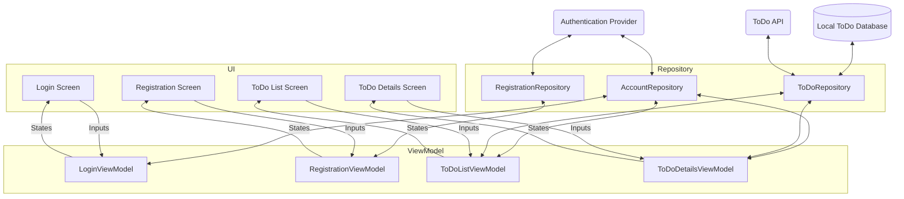

---
---

# Usage Guide

Ballast is an opinionated library, and it was carefully designed to give you a standard workflow for all types of 
screens or components in your application, and on any platform. 

Each platform will have some of its own special setup that may be needed, but the general workflow will be the same, as
outlined here. This guide will cover the basics of getting set up and productive with Ballast, and will try to avoid
any platform-specific functionality, or provide examples for multiple platforms to help you understand the workflow more
generally. Refer to each individual [Platform][1] for further instructions necessary for that platform.

## High-level Workflow

The general workflow for Ballast involves the following steps:

1) Define a Contract
2) Write the InputHandler
3) Write the EventHandler
4) Combine everything into a ViewModel
5) Inject the ViewModel to your UI and start using it

These steps are described in more depth [below](#Ballast-Workflow), and while this workflow does involve a bit of 
boilerplate the [Intellij plugin][8] can help you in quickly scaffolding out all of these classes.

## Project Architecture

Ballast generally works best as part of a layered architecture, consisting of the following layers:

### UI

At the UI layer, you will have things broken up into Screens or Components per your own requirements, and these UI 
pieces should be a "reactive" UI. This basically means that the entire UI for that screen is driven from a State object, 
and the entire UI is updated whenever any part of the State changes. Frameworks like Compose or React were obviously
built to apply these updates efficiently, but non-reactive UI frameworks can be adapted to this pattern fairly easily, 
so using a "reactive UI framework" is not necessary to use Ballast.

Note that "screens" is primarily referring to a Mobile form-factor, while "components" refers more to Desktop or Web. 
Also a "component" as used in this guide would be a bigger, more complex chunk of UI than just a React component, for 
example. Think of components basically as a small portion of the entire Web/Desktop screen that is basically its own
feature, such as a data table with all the filtering capabilities or a tool panel in an IDE, something that would 
basically need to be its own screen on a mobile device.

### ViewModel

Since each screen/component is reactive and driven by a State, you need something to manage that State, which we call a
ViewModel. The purpose of the ViewModel is to live _at least_ as long as the Screen (potentially longer depending on 
platform implementation), and be the class to hold and update the State, dispatching changes back to the UI. 

There should be a 1-to-1 relationship between screens and ViewModels. Each screen should really only be observing a 
single ViewModel, and each ViewModel should not be shared between different screens. If data should be shared between
multiple screens/components it should either be passed from one to the other during navigation, or else managed in the
Repository layer and observed from both screen's ViewModels.

This is the layer that Ballast was primarily designed to implement.

### Repository

The data stored in each screen's ViewModel is really just the local state for that screen, divorced from any persistent
application state. It only knows what is directly needed for that one screen, but there will be a lot more data needed 
in an application than just what is visible on the screen. For example, account session tokens, profile information, 
user preferences, and other data like that will necessarily live much longer than a single screen, and likely needs to 
be shared among different screens (potentially at the same time).

The Repository layer's job is to manage all that data and expose a clean interface to the ViewModels that abstracts away
the complexity of those underlying data sources. The Repository layer shouldn't expose database or API models directly 
to the ViewModel, because those structures are likely to change or use "unsafe" values (nulls, 
[stringly-typed values][6], etc). Instead, it should map those models to safer ones that are easier to work with in the
UI (by parsing Strings into the proper enums, providing default values for nulls, etc.), thereby isolating the UI from
changes to the API or database structure.

By its nature, the Repository layer can be a bit precarious to work on, because one change can affect many parts of your
application. It's also largely an exercise in caching, which we all know is a [hard problem][3]. Traditionally, the
libraries and code that implemented the repository layer was very different from the ViewModel layer, but Ballast's 
[Repository module][2] allows you to use the same mental model for building both, reducing the difficulty of 
context-switching and making the repository layer less intimidating and easier to understand and work with.

### Final Thoughts on Architecture

You'll notice that this layering does not describe any kind of "API layer" or "Database layer", and that is intentional.
It's best to think of those not as discrete layers, but rather just as data sources that are exposed through the 
Repository layer. If you think of the API or Database as a "layer", you will naturally want to conform your application
to the structure of those, which will cause problems if there are any major changes needed in them later on. Instead, 
just build your app using models you define that are easy to work with, and use the Repository layer to conform the API
to the structure of your application. 

And finally, here's a diagram showing an example application designed with this architecture. Consider a basic TODO app
that users must log-in to use.



## Ballast Workflow

This section goes more in-depth into the individual components needed for the full Ballast Workflow. For a quick, 
high-level listing of the classes needed, see [High-level Workflow](#high-level-workflow).

### Define a Contract

The first step for using Ballast on any screen is to define the Contract. The Contract provides a structure for what 
data will be changing in your screen (the State), and how you will be interacting with it (Inputs), which gives you a 
single place to go to understand everything you need to know about any given screen. By having a dedicated Contract, you
won't have any hidden or undocumented functionality that is difficult to reproduce. 

If you're using Ballast in a multiplatform project, the Contract should be in the `commonMain` sourceSet.

See more about defining your contract in {{ anchor(itemId = "Thinking in Ballast MVI", pageAnchorId = "UI Contract", title = "Thinking in Ballast MVI") }}.

```kotlin
object LoginScreenContract {
    data class State(
        val username: TextFieldValue,
        val password: TextFieldValue,
    )

    sealed class Inputs {
        data class UsernameChanged(val newValue: TextFieldValue) : Inputs()
        data class PasswordChanged(val newValue: TextFieldValue) : Inputs()
        object LoginButtonClicked : Inputs()
        object RegisterButtonClicked : Inputs()
    }

    sealed class Events {
        object NavigateToDashboard : Events()
        object NavigateToRegistration : Events()
    }
}
```

### Write the InputHandler

After defining the contract, you should then write the InputHandler to process the Inputs as they are received. The
InputHandler is the class that will be talking to your Repository layer, so any necessary Repositories should be 
provided through the InputHandler's constructor 

If you're using Ballast in a multiplatform project, the InputHandler should be in the `commonMain` sourceSet.

See more about writing your InputHandler in {{ anchor(itemId = "Feature Overview", pageAnchorId = "Input Handlers", title = "Feature Overview") }}.

```kotlin
import LoginScreenContract.*

class LoginScreenInputHandler(
    private val loginRepository: LoginRepository,
) : InputHandler<Inputs, Events, State> {
    override suspend fun InputHandlerScope<Inputs, Events, State>.handleInput(
        input: Inputs
    ) = when (input) {
        is UsernameChanged -> { }
        is PasswordChanged -> { }
        is LoginButtonClicked -> { }
        is RegisterButtonClicked -> { }
    }
}
```

### Connect to the Platform UI

The last step is to actually use Ballast to build out your interactive UI. This typically involves several steps that 
will all be specific to the target you're running Ballast on, but compared to the effort involved with the Contract and
InputHandler, are relatively simple. So even though there is some platform-specific functionality you'll need to write, 
you will still be sharing the majority of the business-logic code in your application.

If you are using Ballast in a multiplatform application, the following pieces will typically be defined in the 
platform-specific sourceSets rather than in `commonMain`.

#### ViewModel

The first step is to define the ViewModel class for each [platform][1]. This will vary slightly depending on which 
platform you target, so that the ViewModel integrates well with the platform's normal lifecycle. For example, on 
Android, you'll make your screen's ViewModel extend `AndroidViewModel`, which is an instance of 
`androidx.lifecycle.ViewModel` that can be provided via Hilt or Navigation-Compose. For platforms that don't have their
own specific ViewModel implementation, or for use-cases where you want to manually control the ViewModel's lifecycle 
through a `CoroutineScope`, you can use `BasicViewModel` as the base class.

All ViewModel implementations will look pretty similar, regardless of the base class used. You'll need to create a
`BallastViewModelConfiguration` and pass it to the base class's constructor, along with any additional parameters needed
for the specific implementation, if any (for example, the `CoroutineScope` of a `BasicViewModel`). This is easiest to 
do with `BallastViewModelConfiguration.Builder`, but you can also structure everything with Dependency Injection, too 
(see section below on [Dependency Injection](#dependency-injection)). The `BallastViewModelConfiguration.Builder` is 
where you will specify the InputHandler and initial State for the ViewModel, as well as providing other more generic
configuration such as loggers or interceptors.

Despite each platform's native ViewModel being named the same and looking very similar, you typically wouldn't define it
with `actual/expect` declarations in a multiplatform project because there's usually no need to share the ViewModel 
itself in common code, so it just creates unnecessary overhead. Furthermore, the base classes for each platform 
typically have different constructors, so it's difficult to provide an `actual/expect` that is actually useful in common 
code for simplifying any DI. It's best to just provide the ViewModel implementations from the platform-specific DI 
modules.

```kotlin
// androidMain/ui/login/LoginScreenViewModel.kt
class LoginScreenViewModel() : AndroidViewModel<
    LoginScreenContract.Inputs,
    LoginScreenContract.Events,
    LoginScreenContract.State>(
    config = BallastViewModelConfiguration.Builder()
        .apply {
            this += LoggingInterceptor()
            logger = { AndroidBallastLogger(it) }
        }
        .withViewModel(
            initialState = LoginScreenContract.State(),
            inputHandler = LoginScreenInputHandler(),
            name = "LoginScreen",
        )
        .build()
)

// jsMain/ui/login/LoginScreenViewModel.kt
class LoginScreenViewModel(
    viewModelCoroutineScope: CoroutineScope
) : BasicViewModel<
    LoginScreenContract.Inputs,
    LoginScreenContract.Events,
    LoginScreenContract.State>(
    config = BallastViewModelConfiguration.Builder()
        .apply {
            this += LoggingInterceptor()
            logger = { JsConsoleBallastLogger(it) }
        }
        .withViewModel(
            initialState = LoginScreenContract.State(),
            inputHandler = LoginScreenInputHandler(),
            name = "LoginScreen",
        )
        .build(),
    eventHandler = LoginScreenEventHandler(),
    coroutineScope = viewModelCoroutineScope,
)
```

#### EventHandler

The next step is to define an `EventHandler` for your ViewModel. The implementation will look very similar to an 
InputHandler, except that it will typically need a different implementation on each platform for handling things like
navigation requests (though this may not always be the case if you have your routing/navigation implemented entirely in
common code).

```kotlin
import LoginScreenContract.*

class LoginScreenEventHandler : EventHandler<Inputs, Events, State> {
    override suspend fun EventHandlerScope<Inputs, Events, State>.handleEvent(
        event: Events
    ) = when (event) {
        is Events.Notification -> { }
    }
}
```

You may have noticed from the example ViewModel code above that the `BasicViewModel` has you providing the EventHandler
directly in its constructor, while the `AndroidViewModel` does not. This is because EventHandlers are closely related to
the lifecycle of the ViewModel, but don't necessarily follow the exact same lifecycle. The EventHandler typically lives
as long as the screen is active, but the ViewModel itself may be retained across multiple times of the screen being 
stopped and started. 

For a `BasicViewModel`, the lifecycle of the Screen, ViewModel, and EventHandler are all the same, and they're all
controlled by the lifetime of the `CoroutineScope`. When moving to a new screen, the screen's `CoroutineScope` is 
cancelled, the ViewModel's processing is stopped, and the EventHandler detached. For this reason, the `EventHandler` is
provided through the `BasicViewModel`'s constructor, to make sure they all respect the same lifecycle.

But on Android, it is not possible to use Hilt to inject a ViewModel with anything that depends on the Activity, since a 
ViewModel lives longer than the Activity. Since the `EventHandler` is commonly used for handling Navigation requests, 
and navigation is done by the activity through `Activity.startActivity()` or `findNavController().navigate()`, it is 
impossible to inject the `EventHandler` directly into the ViewModel, but instead it must be attached dynamically after
the ViewModel has been injected. See the [Android platform page][5] for specific instructions.

#### UI

The final piece of the Ballast puzzle is actually defining your UI given the Ballast State. This typically involves 
creating or accessing an instance of your ViewModel and observing its State as a `StateFlow` with 
`viewModel.observeStates()`. On each emission of that StateFlow, you will update the entire UI of the screen with the 
new State, as per for the platform-specific requirements. 

On platforms that require the native programming language to use rather than Kotlin (SwiftUI, for example), there may be
some boilerplate needed to wrap the Kotlin coroutines and `StateFlow` into something that the platform's native code can
integrate with. But on Android, and using Compose for Desktop or Web, this is easily done in Kotlin. See each 
[platform's][1] instructions for how to connect to the actual UI toolkit.

## Dependency Injection

Most apps will use some kind of DI, and Ballast is set up very well to provide all the necessary pieces via DI. Some of
the classes, especially the InputHandler, can typically be provided in common code, but other classes, like the 
ViewModel or EventHandler, must be provided in the platform-specific modules. 

The best way to save time and LOC with DI is to provide a common definition of `BallastViewModelConfiguration.Builder` 
with the configuration common to all ViewModels (the Logging and Debugger Interceptors, for example), and then using
that common builder to create the actual configuration for each ViewModel. Rewriting the ViewModel class to be setup
with DI might look something like this:

```kotlin
class LoginScreenViewModel(
    config: BallastViewModelConfiguration<
        LoginScreenContract.Inputs,
        LoginScreenContract.Events,
        LoginScreenContract.State>,
) : AndroidViewModel<
    LoginScreenContract.Inputs,
    LoginScreenContract.Events,
    LoginScreenContract.State>(
    config = config
)
```

Using Koin on Android, the DI might look like this:

```kotlin
val platformModule = module {
    factory<LoginApi> {
        LoginApiImpl()
    }
    single<LoginRepository> {
        LoginRepositoryImpl(
            loginApi = get()
        )
    }
    factory<BallastViewModelConfiguration.Builder> {
        BallastViewModelConfiguration.Builder()
            .apply {
                this += LoggingInterceptor()
                logger = { AndroidBallastLogger(it) }
            }
    }
    factory<LoginScreenInputHandler> {
        LoginScreenInputHandler(
            loginRepository = get()
        )
    }
    viewModel<LoginScreenViewModel> { 
        LoginScreenViewModel(
            config = get<BallastViewModelConfiguration.Builder>()
                .withViewModel(
                    initialState = LoginScreenContract.State(),
                    inputHandler = get<LoginScreenInputHandler>(),
                    name = "LoginScreen",
                )
                .build(),
        ) 
    }
}

class LoginActivity : AppCompatActivity(), KoinComponent {
    private val viewModel: LoginScreenViewModel by viewModel()
}
```

For some platforms, you will need to provide parameters from the UI when accessing the ViewModel instance, such as a
`CoroutineScope`. This is done through assisted injection. Again using Koin, this is what this would look like for JS:

```kotlin
val platformModule = module {
    factory<LoginApi> {
        LoginApiImpl()
    }
    single<LoginRepository> {
        LoginRepositoryImpl(
            loginApi = get()
        )
    }
    factory<BallastViewModelConfiguration.Builder> {
        BallastViewModelConfiguration.Builder()
            .apply {
                this += LoggingInterceptor()
                logger = { JsConsoleBallastLogger(it) }
            }
    }
    factory<LoginScreenInputHandler> {
        LoginScreenInputHandler(
            loginRepository = get()
        )
    }
    factory<LoginScreenViewModel> { (coroutineScope: CoroutineScope) ->
        LoginScreenViewModel(
            config = get<BallastViewModelConfiguration.Builder>()
                .withViewModel(
                    initialState = LoginScreenContract.State(),
                    inputHandler = get<LoginScreenInputHandler>(),
                    name = "LoginScreen",
                )
                .build(),
        ) 
    }
}

class LoginPage : KoinComponent {
    @Composable
    fun LoginContent() {
        val viewModelScope = rememberCoroutineScope()
        val viewModel: LoginScreenViewModel = remember(viewModelScope) { get { parametersOf(viewModelScope) } }
    }
}
```

Of course, it is possible to use Ballast with any other DI tool out there as well, such as Dagger/Hilt, Kodein, or even
hand-written DI. The process for using any of those options will be very similar, just using that tool's specific DSL
for providing and accessing instances of each class.

## Folder Structure

It's best to structure your applications such that each screen is in its own subfolder of `ui/`, which contains all of 
the relevant classes for both Ballast and the UI. Likewise, each Repository should be in its own folder of 
`repository/`. 

For example, in a pure-Android application, the [four examples][7] would
be structured like this:

```
app/
└── src/main/kotlin/
    ├── api/
    │   └── bgg/
    │       └── BggApi.kt
    ├── repository/
    │   └── bgg/
    │       ├── BggRepository.kt
    │       ├── BggRepositoryImpl.kt
    │       ├── BggRepositoryContract.kt
    │       └── BggRepositoryInputHandler.kt
    ├── ui/
    │   ├── counter/
    │   │   ├── CounterContract.kt
    │   │   ├── CounterInputHandler.kt
    │   │   ├── CounterEventHandler.kt
    │   │   ├── CounterViewModel.kt
    │   │   └── CounterFragment.kt
    │   ├── scorekeeper/
    │   │   ├── ScorekeeperContract.kt
    │   │   ├── ScorekeeperInputHandler.kt
    │   │   ├── ScorekeeperEventHandler.kt
    │   │   ├── ScorekeeperViewModel.kt
    │   │   └── ScorekeeperFragment.kt
    │   ├── bgg/
    │   │   ├── BggContract.kt
    │   │   ├── BggInputHandler.kt
    │   │   ├── BggEventHandler.kt
    │   │   ├── BggViewModel.kt
    │   │   └── BggFragment.kt
    │   └── kitchensink/
    │       ├── KitchenSinkContract.kt
    │       ├── KitchenSinkInputHandler.kt
    │       ├── KitchenSinkEventHandler.kt
    │       ├── KitchenSinkViewModel.kt
    │       └── KitchenSinkFragment.kt
    ├── MainApplication.kt
    └── MainActivity.kt
```

When using Ballast in a multiplatform app, the folder structure will not change, but you will have some of those classes
moved between the different sourceSets, as needed for each platform.

```
app/
├── src/commonMain/kotlin/
│   ├── api/
│   │   └── bgg/
│   │       └── BggApi.kt
│   ├── repository/
│   │   └── bgg/
│   │       ├── BggRepository.kt
│   │       ├── BggRepositoryImpl.kt
│   │       ├── BggRepositoryContract.kt
│   │       └── BggRepositoryInputHandler.kt
│   └── ui/
│       ├── counter/
│       │   ├── CounterContract.kt
│       │   └── CounterInputHandler.kt
│       ├── scorekeeper/
│       │   ├── ScorekeeperContract.kt
│       │   └── ScorekeeperInputHandler.kt
│       ├── bgg/
│       │   ├── BggContract.kt
│       │   └── BggInputHandler.kt
│       └── kitchensink/
│           ├── KitchenSinkContract.kt
│           └── KitchenSinkInputHandler.kt
├── src/androidMain/kotlin/
│   ├── ui/
│   │   ├── counter/
│   │   │   ├── CounterEventHandler.kt
│   │   │   ├── CounterViewModel.kt
│   │   │   └── CounterFragment.kt
│   │   ├── scorekeeper/
│   │   │   ├── ScorekeeperEventHandler.kt
│   │   │   ├── ScorekeeperViewModel.kt
│   │   │   └── ScorekeeperFragment.kt
│   │   ├── bgg/
│   │   │   ├── BggEventHandler.kt
│   │   │   ├── BggViewModel.kt
│   │   │   └── BggFragment.kt
│   │   └── kitchensink/
│   │       ├── KitchenSinkEventHandler.kt
│   │       ├── KitchenSinkViewModel.kt
│   │       └── KitchenSinkFragment.kt
│   ├── MainApplication.kt
│   └── MainActivity.kt
├── src/iosMain/kotlin/
│   └── ui/
│       ├── counter/
│       │   ├── CounterEventHandler.kt
│       │   └── CounterViewModel.kt
│       ├── scorekeeper/
│       │   ├── ScorekeeperEventHandler.kt
│       │   └── ScorekeeperViewModel.kt
│       ├── bgg/
│       │   ├── BggEventHandler.kt
│       │   └── BggViewModel.kt
│       └── kitchensink/
│           ├── KitchenSinkEventHandler.kt
│           └── KitchenSinkViewModel.kt
└── src/jsMain/kotlin/
    ├── ui/
    │   ├── counter/
    │   │   ├── CounterEventHandler.kt
    │   │   ├── CounterViewModel.kt
    │   │   └── CounterComponent.kt
    │   ├── scorekeeper/
    │   │   ├── ScorekeeperEventHandler.kt
    │   │   ├── ScorekeeperViewModel.kt
    │   │   └── ScorekeeperComponent.kt
    │   ├── bgg/
    │   │   ├── BggEventHandler.kt
    │   │   ├── BggViewModel.kt
    │   │   └── BggComponent.kt
    │   └── kitchensink/
    │       ├── KitchenSinkEventHandler.kt
    │       ├── KitchenSinkViewModel.kt
    │       └── KitchenSinkComponent.kt
    └── main.kt
```

[1]: {{ 'Platforms' | link }}
[2]: {{ 'Ballast Repository' | link }}
[3]: https://martinfowler.com/bliki/TwoHardThings.html
[4]: http://localhost:8080/wiki/mental-model#ui-contract
[5]: {{ 'Android' | link }}
[6]: https://wiki.c2.com/?StringlyTyped
[7]: {{ 'Examples' | link }}
[8]: {{ 'Ballast Intellij Plugin' | link }}
