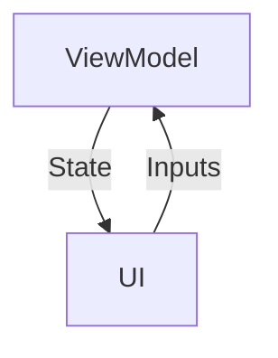
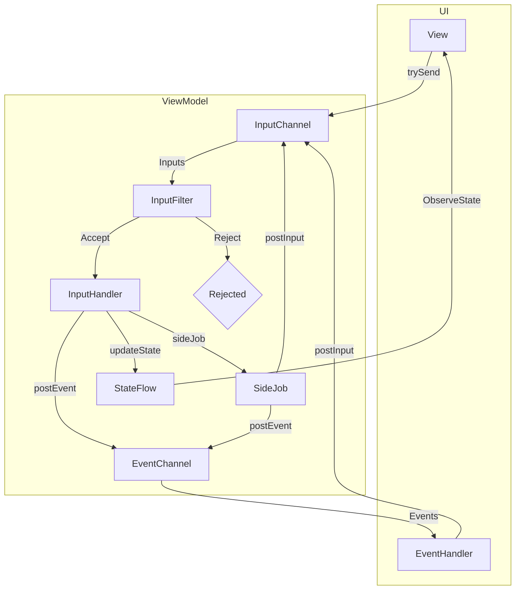
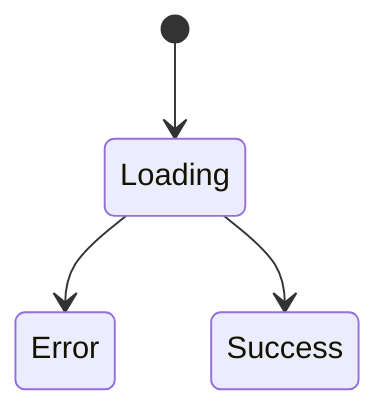
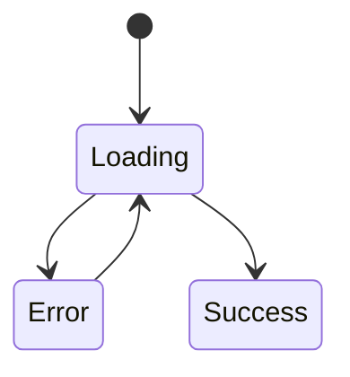
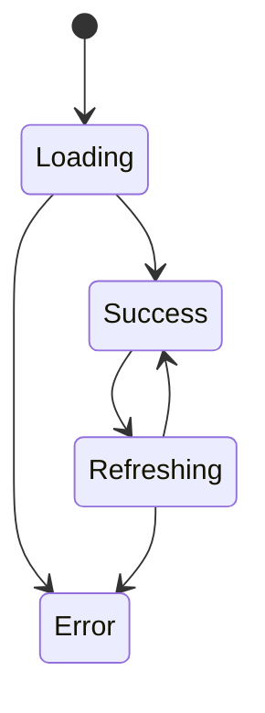
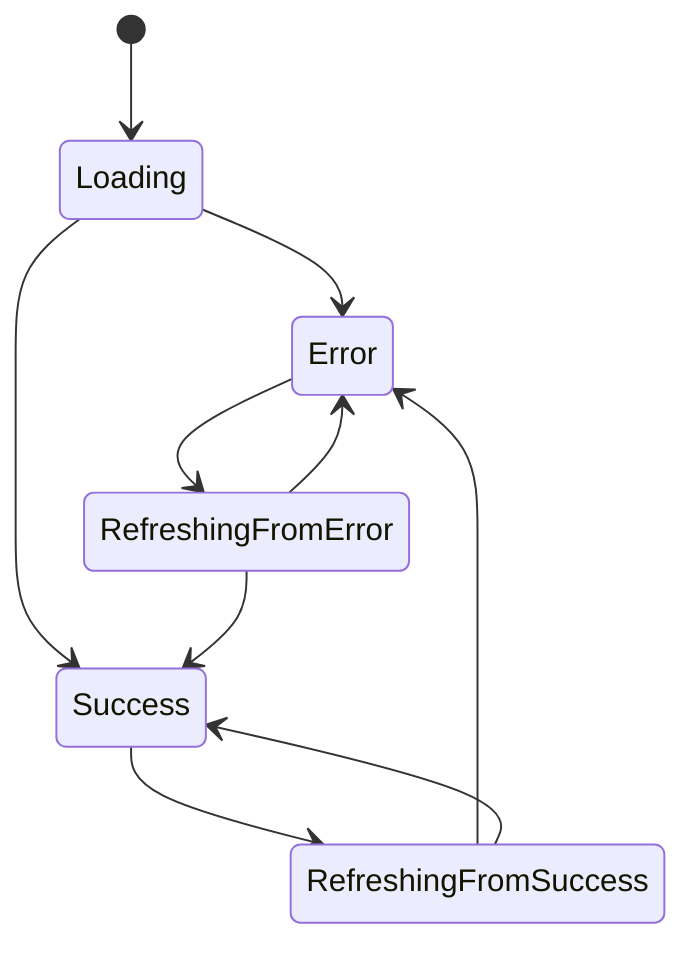

---
---

# Thinking in Ballast MVI

The [Feature Overview][14] highlights the main features and APIs of the Ballast library, and is a good place to start 
for understanding the use-case of this library. This page digs deeper into some of those concepts to more fully explore 
the motivation behind this library and the reasoning behind it's opinionated structures, and the mechanics of some of
its more advanced features.

## Ballast Overview

Ballast is a library implementing an opinionated structure of the MVI state management architecture pattern, based on
the concept Unidirectional Data Flow. This pattern has been used and implemented by a variety of libraries across many
languages and under a variety of names, such as [Flux][1], [Redux][2], [Vuex][3], [The Elm Architecture][4], [MVI][5],
[UDF][6], etc. The idea behind all these libraries is sound and leads to clean UI architecture, and Ballast is just one
particular way to do it. The above links are also good sources for understanding this pattern more generally, as well.

The core idea is to model your UI not as discrete UI elements with click listeners, changing text, local state, etc.
that all needs to be synced and updated manually, but instead to lift that state into a ViewModel and update the entire
UI whenever the ViewModel state changes. This idea of "lifting state" naturally forms a loop in your UI, where:

- the **ViewModel** holds **State**, which gets pushed to the UI with every change
- the UI updates itself to match the current **State**
- The user interacts with the UI, producing **Inputs**, or their "intent" to change the UI state.
- The **Inputs** get sent back to the **ViewModel**, where it processes the **Inputs** to change the State

Notably, in this loop, the UI is never responsible for updating the **State** itself, and there is no business logic
code that depends on any data held anywhere but the **State**. The UI only dispatches **Inputs** directing the ViewModel
to update the state, and all processing is done within the **ViewModel**, asynchronously, and any changes to the
**State** as a result of processing an **Input** will be pushed back to the UI automatically. You can visualize the loop
like so:



This diagram is the simplest form of MVI, but Ballast adds a bit more structure and more features to this core loop,
which are needed to build a fully-functional and _safe_ UI "state machine". Ballast itself is built around Kotlin
[Coroutines](https://kotlinlang.org/docs/coroutines-overview.html),
[Structured Concurrency](https://elizarov.medium.com/structured-concurrency-722d765aa952),
and [Flows](https://kotlinlang.org/docs/flow.html), though familiarity with them is not strictly necessary to use
Ballast. A more complete diagram of the Ballast MVI model looks more like the diagram below. See
[Features][8] for more information on the features described in this diagram.



## UI Programming Through the Years

To better understand the MVI pattern, how Ballast implements it, and why certain things are done in this way, let's go
back in time and walk through the evolution of UI programming through the years to understand how MVI came to be the
favored pattern that it is today.

Note that this brief history is based on my personal experiences and observations over the last ~10 years of software
development, and draws heavily from a native Android and web dev perspective. You may have a different opinion on the
exact timelines, descriptions, pros, or cons of certain patterns, but I'm not looking to start an argument. I'm simply
wanting to show the evolution that I have observed, that ultimately led to the Ballast MVI library as it stands today.

### Traditional UI programming

In traditional UI programming, there is no separation (or only superficial separation) between the UI elements and the
code that is run when interacting with those elements. Take the following snippet, which is something you might see in a
traditional Android Activity's UI implementing a simple counter:

```kotlin
override fun onCreate() {
    setContentView(R.layout.activity_main)
    val button: Buttoon = findViewById(R.id.button)
    val counterText: TextView = findViewById(R.id.counter_text)

    button.setOnClickListener {
        val currentCount = counterText.text.toString().toInt()
        val incrementedCount = currentCount + 1
        counterText.setText("$incrementedCount")
    }
}
```

For comparison, here's the same thing in HTML/JS.

```js
var button = document.getElementById("button");
var counterText = document.getElementById("counter_text");

function handleClick() {
    var currentCount = parseInt(counterText.textContent)
    var incrementedCount = currentCount + 1
    counterText.innerHTML = incrementedCount
}
button.onclick = handleClick
```

This approach, so common in many older applications, has a number of problems:

- How do we get the current counter value?
    - Answer: get the text directly from the UI element, and parse it to a String
- What happens if the text in the UI element is not a valid number?
    - Answer: `¯\_(ツ)_/¯`
- What happens if the button is clicked many times very quickly?
    - Answer: Clicks must be handled on the main UI thread, to make sure there are no race conditions
- Ok, but what if it does get called quickly from many different threads?
    - Answer: `¯\_(ツ)_/¯`
- How do I test this code?
    - Answer: You'll need to run your tests in a real device/browser or emulated environment
- What if that button click needs to make an API call?
    - Answer: You'll need to run that code in the background, receive the callback on the main thread, and update the UI in that
      callback
- What if the data stored in the UI changes by the time the API call returns?
    - Answer: `¯\_(ツ)_/¯`
- I saw a really strange bug report. How can I reproduce that bug?
    - Answer: Manually follow the exact series of steps that put the user in that scenario
- How do I figure out those steps that the user did?
    - Answer: `¯\_(ツ)_/¯`
- What if the UI state is a result of parallelism and was a freak occurrence?
    - Answer: `¯\_(ツ)_/¯`

### MVP

- _Not really used on Web_
- _2013 to 2019 on Android_

Early attempts to solve these problems started to spring up, especially with the **MVP** pattern on Android. The main
idea here was to move all the "business logic" code out of the "view" and into a "presenter" class. The View connects
all its clicks and other interactions to call methods on the Presenter, and the Presenter acts as fake "view" so the
code isn't directly tied to the Android View or Browser.

```kotlin
class CounterPresenter(private val view: CounterView) {
    private var currentCount = 0
    fun onButtonClick() {
        val incrementedCount = currentCount + 1
        view.setCounterText("$incrementedCount")
        currentCount = incrementedCount
    }
}

interface CounterView {
    fun setCounterText(text: String)
}

class CounterActivity : AppCompatActivity(), CounterView {

    override fun onCreate() {
        setContentView(R.layout.activity_main)
        val button: Buttoon = findViewById(R.id.button)
        val presenter = CounterPresenter(this)

        button.setOnClickListener {
            presenter.onButtonClick()
        }
    }

    override fun setCounterText(text: String) {
        val counterText: TextView = findViewById(R.id.counter_text)
        counterText.setText("$incrementedCount")
    }
}
```

This approach gained a lot of popularity because it allowed one to test the busisness logic in a normal unit test,
without needing a full real or emulated environment. But this approach has a number of flaws, some of which are inherent
in its design, and some are just problems with the real-world implementation of it.

- The Presenter had to add a `currentCount` variable, since it no longer has direct access to the View to read the
  current text in the UI element. We now have the same value in 2 separate places.
- What if we want to change the `currentCount` variable from multiple places?
    - Answer: We need to make sure that code updates both the internal variable and the UI element
- What's the value shown in the UI before clicking the button?
    - Answer: We need to make sure the default value in the UI matches that of the Presenter's value.
- What if I need to make a really quick addition to the UI. Do I really have to jump through all these hoops?
    - Answer: Yes. The MVP pattern means you need to add all the boilerplate for it.
- But this really needs to go out quickly. I'm just going to do it the normal way.
    - Answer: I mean, I can't really stop you, but you really shouldn't...

And this is the main reason why I personally don't think MVP is a very good design pattern. It is really only a
superficial separation, but you're basically writing the same code you would normally but with much more boilerplate.
There is nothing in the pattern itself that requires you to follow it, and in practice, it's likely you'll run into
portions of code that do not follow the pattern strictly, giving you a frankenstein mix of code split between
programming styles, and state being held all over the place, leaving you worse off than not having the MVP pattern at
all.

MVP: Good in theory, but rarely implemented well in practice.

### MVVM

- _2010 to 2016 on web with Angular.JS_
- _2016 to 2019 on Android with Databinding, but never became too popular_

Once everyone started noticing the problems inherent in traditional- and MVP-style UI programming, the natural fix
became pretty apparent: rather than the interactions driving the UI, let's use a state model to drive the UI. One starts
by creating a model of the screen's state, and then builds a UI that is assembled or synchronized to match that model.

These are the early days of reactive programming, when Angular.JS was king, React was just starting to be developed,
and all the UI toolkits started creating their own "MVVM" frameworks. The main idea with these is that you take
something like a "Presenter" or "Controller" class, declare the state that lives within that Controller, and let a
framework worry about applying that state to the UI for you. Additionally, the MVVM frameworks bind in the other
direction, too, automatically wiring up click listeners and such so that they always run code in the Controller.

This was a huge improvement over the previous attempts. We now have a way to make sure any changes to the state will
always be present in the UI, even changes made from other threads, and the framework enforces that all changes to the
UI must go through the Controller and the MVVM framework.

MVVM started with Angular.JS and we started seeing MVVM frameworks popping up everywhere: Android, Xamarin, a thousand
different Javascript frameworks, etc. But MVVM is not without its issues: most notably being that the MVVM framework
needs to have intimate knowledge of both the View and your Controller. The framework itself would have to be updated
anytime the underlying Views changed, as well as knowing about all container types that might hold data in the
Controller, to know how to convert those values into something displayed in the UI.

As a result, MVVM frameworks tended to lag behind the actual frameworks themselves, the frameworks themselves were
pretty large and might not always have the best performance, and especially for things like displaying lists of content,
it was just more difficult than it needed to be.

### MVI

- _2013 and later on web, with React_
- _2019 and later on Android, with Compose_
- _2019 and later on iOS, with Swift UI_
- _2017 and later with Flutter_

MVI was the next iteration of UI programming, and by all accounts it seems to be the one that will stick around. It
solves many of the problems outlined with traditional programming, but does it in a much more lightweight and
unobtrusive way than MVVM, giving all the power back into the hands of the programmer and allowing them to write the
same code they would expect when working with a UI toolkit, but providing structure around the state and interactions
required of the UI.

The core difference between MVVM and MVI is this: MVVM uses an automated middle-man to apply state to UI and send
change requests from the UI to the Controller (or ViewModel). MVI forgoes that middleman and implements a more
transparent mechanism for moving State and Inputs between the UI and ViewModel, and asks the programmer to be that
middle-man. Instead of automatically applying the State to the UI, the MVI pattern gives the programmer the State that
should be applied to the UI, and allows the programmer to pick their UI toolkit and programming style to apply the
State themselves.

This idea is what Facebook started with the Flux architecture and React, and soon afterwards you started seeing more and
more platforms rewriting their UI toolkits around this exact philosophy. Flutter, Swift UI, Jetpack Compose, all based
around this idea that the UI shouldn't have to manage anything itself, but should be driven entirely by some model of
State and applied to the UI with hand-written code.

This MVI model has proven itself over the last few years to be incredibly durable and robust, even useful outside of
pure UI applications. And the more I work on Ballast and really figure out how this pattern works, the more flexible and
powerful I find it to be, enabling all sorts of incredible use-cases that are simply impossible with traditional
programming techniques, like time-travel debugging, undo/redo, multi-user synchronization, and many others.

Hopefully this brief history of UI programming has given you some things to think about which will help you understand
more about the specific design choices of Ballast, as outlined throughout the rest of this document.

## Kinds of State

When thinking about how to structure your application, it's necessary to consider the different kinds of state you may
need to manage. [State Holders and UI State][10] in the Android documentation does a great job of exploring some of the
kinds of state you will need to manage, and is a great read that is broadly applicable to all UI programming, not just
Android.

Here's a summary of the different kinds of state your app will need to manage.

### Screen UI State

> Screen UI state is _what_ you need to display on the screen.

Screen UI state is _what_ you need to display on the screen. It is typically the kind of data that is loaded from some
local or remote data source. This is the state the user intends to interact with or change, and is the real data that
they care about and what drives them to use your application. Screen UI state is also usually independent of the
application lifecycle, meaning that the actual subscriptions to the data sources may be paused when the app goes into
the background, but the data itself doesn't need to be cleared, reset, or refreshed upon returning to the app. Simply
re-subscribing to the data source is sufficient to restore the screen to the proper state.

Screen UI state is the primary use-case for using Ballast, which gives a clean and predictable mechanism for loading and
updating the data that the user cares about. The explicit modeling of this data also makes it easy for developers to
immediately understand the use-case of a given screen, but showing which data can be changed.

### UI Element State

> UI element state refers to properties intrinsic to UI elements that influence how they are rendered.

UI element state refers to properties intrinsic to UI elements that influence how they are rendered. This is the data
that the user doesn't consciously or intentionally interact with, but is necessary to present the Screen UI state in a
way that is pleasant to the end-user. UI element states are usually tied to the application lifecycle. You may need to
do some extra work to ensure the data is saved/restored (or cleared/reset) when the app goes into the background and
then resumes.

UI Element state is usually better managed within the UI itself, rather than within your screen's ViewModel. In Compose,
these are values you'd rather manage as `remember { mutableStateOf() }`. Since they're not important enough to manage
at the ViewModel level, they are ephemeral and reset each time you view the screen, but also avoid cluttering the
ViewModel state with properties that aren't important to the end-user.

### Global Application State

Global application state is the data that must be shared across multiple screens. It's usually a mix of data that the
user cares about and is displayed to them as Screen UI State, but also data they aren't aware of but is necessary to
load their data properly, such as an API session token. Broadly-speaking, global application state lives at a layer
above the UI and thus should be independent of the application lifecycle, and we typically call this the"Repository
Layer".

The structure of your app's global state can be quite complicated, and may be further broken down into several other
layers or modules, such as Use-Cases, Repositories, Caching Layer, and Data Sources. The specifics of how these layers
work together can be very complex, but if you think of this layer less as a series of interconnected modules, and more
like you would with your UI state, then it can be a bit easier to manage. That is, consider all your data sources as the
source of truth for the global state, but shouldn't be directly subscribed to by the UI. Rather, subscribe and cache the
latest values in memory, in a Ballast ViewModel, so that the combination of states from the various sources works much
like the State in the UI, which itself comes from multiple sources like the Repository layer or entered by the user.

## Kinds of State Classes

The section above talks generally about how to think about different kinds of state in your app, but at some point that
state needs to be realized into concrete classes in your Kotlin code. The biggest question here is what kind of class to
use, with the typical options being either a `sealed class` or a `data class`. Other options, historically, were to use
and Androidx `ViewModel` with `LiveData<T>` properties, or more recently a class with many `StateFlow<T>` or Compose
`State<T>` properties.

I firmly believe that a `data class` is the best way to start modeling your UI state vs those other two options, and
this is the form that is encouraged throughout the Ballast library and documentation. While Ballast enforces no
restrictions on what kind of class you use for your State, this section aims to show you why I believe this to be
the best starting point. That's not to say it's the best for all situations, but I do believe it will give you the best
result while causing the fewest difficulties in the majority of use-cases.

### Sealed Class

Using a `sealed class` seems to be the most popular solution if you go by the articles you find on a quick web search.
And it's clear to understand why: compared to the traditional way of building UIs, a sealed class gives you a way to
ensure that the data on your screen is consistent with itself.

Take the following example from the article [Modelling UI State on Android][7]:

> The Challenge: Build an app that calls a traffic light endpoint and shows the color of the traffic light (red, yellow
> or green). During the network call show a ProgressBar. On success show a View with the color and in case of an error
> show a TextView with a generic text. Only one view is visible at a time and there is no possibility to retry errors**.

_**we will relax this qualifier later to explore how it affects the resulting states_

```kotlin
sealed class TrafficLightState {
    data object Loading : TrafficLightState()
    data object Error : TrafficLightState()
    data class Success(val color: Color) : TrafficLightState()
}
```

This assumes that you visit a screen, it immediately starts loading data from a remote source, and then returns a
result. The result may have been the data you're looking for, or maybe something went wrong like a network failure, and
this form gives a clear indication of what exactly to show in the UI. You can also easily translate this into a UML
state diagram:



But what happens if the error was an intermittent network failure, and you want to refresh the data? Then, it will move
from `Error` back to `Loading`, and whatever error message you displayed is now hidden as the progress indicator is
shown again. That's not an issue, this is probably what the user would expect. Here's the change needed to model this
action in the state diagram:



But what if you added a pull-to-refresh action, so that the user can request the state update? The screen displayed the
data with the `Success` state, but then hides it all to display the progress indicator in the `Loading` state. Not great
UX. Well, we can fix that by adding a new state to the UI, such as
`data class Refreshing(val color: Color) : TrafficLightState()`, that can signal to the UI to display the progress
indicator and the traffic light color at the same time. The state diagram now looks like this:



Or if we wanted to update the error refreshing state so that the error is still shown with the progress indicator over
it, well that's yet another discrete state we need to model:



I hope you see where I'm going with this.

The idea that a state is so easily mapped 1-1 to discrete values sounds great in theory, but doesn't hold up so well to
real-world, non-trivial use-cases. It's difficult to extend, leads to repetition, and you end up with a combinatorial
matrix of states that can quickly grow overwhelmingly complex. And while the sealed subclasses themselves model the
discrete states well, they actually do nothing to model the _transitions_ between states. You can't use the type system
to ensure you don't move from one state to another, and if you need to move between states and carry the data with it
(such as from `Success` to `RefreshingFromSuccess`), then you have to abuse the type system to perform type-checks or
type-casts to actually make that transition.

And finally, to drive the point home, let's consider what the actual UI code looks like here in this final case.
Assuming we want to share the UI widgets whenever possible we get this:

```kotlin
@Composable
fun TrafficLight(state: TrafficLightState) {
    // display progress bar in Loading or Refreshing states
    if(state is Loading || state is RefreshingFromSuccess || state is RefreshingFromError) {
        CircularProgressIndicator()
    }

    // display the traffic light color when it's available
    val trafficLightColor: Color? = when(state) {
        is Success -> state.color
        is RefreshingFromSuccess -> state.color
        else -> null
    }
    if(trafficLightColor != null) {
        TrafficLightColor(trafficLightColor)
    }

    // and a similar thing happens with the error text, except we just check types directly
    if(state is Error || state is RefreshingFromError) {
        TrafficLightError()
    }
}
```

Alternatively, you could have discrete `@Composable` functions for each discrete state, but then there's no UI
consistency between those states. If you make a change to one, you'd have to duplicate that change everywhere. Or if you
keep it in one function, as in the example above, you have to put in a ton of logic in the UI portion just to
accommodate the discrete UI types, while still not really having discrete UIs for it.

The linked article suggests that the sealed class is best because its cardinality (number of possible states) is 5 vs
16 with a data class. But actually, if you expand the use-case to allow pull-to-refresh, the cardinality actually
becomes:

```
   1 Loading
   1 Error
   3 Success
   1 RefreshingFromError
 + 3 RefreshingFromSuccess
--------------------------
   9 Total
```

Cardinality of 9 is still better than 16, but this is really broken up into 5 discrete cases, each of which must be
handled explicitly. In contrast, there's only 3 "cases" that need to be considered with the data class, and the implicit
combinations of those cases account for all 16 cardinal states. Additionally, you'd have to explicitly account for the
transitions between states, of which there are 8. So in all, there are 17 pieces of data that need to be managed
explicitly between the states and the transitions, versus 16 that are managed implicitly with a data class. Again, with
small numbers of discrete states, this isn't necessarily a deal-breaker, but with larger complex screens it absolutely
is. And making changes to the state of a data class will implicitly make the update everywhere needed, while those same
changes to sealed classes would need an exponentially large number of code updates to accommodate them with each
successive change.

So again, while this style sounds great in theory, it really just doesn't hold up when put into real-world code.

### Data Class

Whereas a `sealed class` maps well to discrete states but causes complexity when it comes to actually applying that to
the UI and its interactions, a `data class` does the opposite: you first think about the data you want to display on the
UI, and you write your code to enforce the consistency of it. For example, the [Modelling UI State on Android][7]
article uses the following as an example of what not to do (and what I think you _should_ do):

```kotlin
data class TrafficLightState(
    val isLoading: Boolean,
    val isError: Boolean,
    val color: Color?
)
```

That article's argument against this state is that it has invalid states. For example, you could have `isError` true at
the same time that `color` is non-null, and what do you show in the UI at that point?

The answer is pretty simple: just don't let that happen. Since it's a single immutable object, you have full control
over every property of it, and you can put that kind of logic directly within the class to ensure we never get a state
that has both data and an error:

```kotlin
data class TrafficLightState(
    val isLoading: Boolean,
    val isError: Boolean,
    val color: Color?
) {
    init {
        if(isError && color != null) {
            throw IllegalStateException("error: cannot have both an error and color at the same time")
        }
    }
}
```

Notice that with this 1 change, we can now model all potential use-cases from the `sealed class` scenario, even the
complex transitions of pull-to-refresh:

```kotlin
val Loading = TrafficLightState(
    isLoading = true,
    isError = false,
    color = null,
)
val Error = TrafficLightState(
    isLoading = false,
    isError = true,
    color = null,
)
val Success = TrafficLightState(
    isLoading = false,
    isError = false,
    color = Color.Green,
)
val RefreshingAfterSuccess = TrafficLightState(
    isLoading = true,
    isError = false,
    color = Color.Green,
)
val RefreshingAfterError = TrafficLightState(
    isLoading = true,
    isError = true,
    color = null,
)
```

Without making any changes to the state class itself, we were able to extend it to support the additional use-cases
without adding any complexity to the screen. Furthermore, modeling the additional use-cases in the UI comes for free:
by adding the code to do pull-to-refresh, all we need to do is `state.copy(isLoading = true)`, and whatever state we were
previously in, be it error or success, will be displayed properly in the UI. For example:

```kotlin
@Composable
fun TrafficLight(state: TrafficLightState) {
    if(state.isLoading) {
        CircularProgressIndicator()
    }

    if(state.color != null) {
        TrafficLightColor(state.color)
    }

    if(state.isError) {
        TrafficLightError()
    }
}
```

So much cleaner than the version using a `sealed class`! When it comes down to it, it's the same exact UI, using the
same `if`-statements, but this is so much more readable. It's much easier to look at this code and figure out which
properties we need to set to get the UI to look a certain way, than if we were to model it with the sealed class. In
reality, we don't care as much as having discrete UI states as we do _consistent_ UI states. While the sealed class
approach does give us incredibly consistent data models for the state, it doesn't actually produce a very consistent UI
unless we do a lot of work to make it so. In contrast, data classes aren't as great as making a consistent model, but
make for a much more consistent UI, which is what the user is actually looking at and interacting with. And when using
an MVI approach like Ballast to protect updates to the state, you can enforce the consistency of the state yourself just
in how your make updates to it.

Furthermore, this style is actually not completely divorced from sealed classes! You can use the `data class` as the
main state holder, and still define individual mutually-exlusive properties within that state as `sealed classes`, to
get the same kind of benefit! These intermediary classes can be modeled with the built-in `Result` type, or you can
write your own wrapper for a more domain-specific result. For example:

```kotlin
data class TrafficLightState(
    val isLoading: Boolean,
    val color: Result<Color>?,
)
@Composable
fun TrafficLight(state: TrafficLightState) {
    if(state.isLoading) {
        CircularProgressIndicator()
    }

    // state.color is null until loading hs completed, at which point it is either Success or Failure
    state.color?.fold(
        onSuccess = {
            TrafficLightColor(it)
        },
        onFailure = {
            TrafficLightError()
        }
    )
}
```

### Multiple Streams

The final approach to modeling a UI state isn't really even compatible with Ballast, but it's a pattern that
historically has been very popular. It's really an evolution of the [MVVM](#mvvm) pattern, where you write code to apply
these properties selectively to the UI rather than letting an automated framework do it. I see this pattern less now
than I used to, as folks tend to use a single State Holder class as described above in a `StateFlow` rather than
multiple `LiveData`, ReactiveX `Observable`, or single-property `StateFlow`. However, this pattern does seem to remain
popular with Compose, especially when folks want to use `State` properties within a `ViewModel`.

In this approach the `ViewModel` itself is considered the UI state, rather than being the thing that holds onto the UI
state. Each property you want to expose to the UI is a separate reactive property, so that anything you want to update
in the UI just needs to observe the appropriate property and react in kind:

Also taking the example from [Modelling UI State on Android][7] (but replacing `LiveData` with `StateFlow`):

```kotlin
class TrafficLightViewModel : ViewModel() {
    private val _loading = mutableStateFlow<Boolean>(false)
    private val _error = mutableStateFlow<Boolean>(false)
    private val _color = mutableStateFlow<Color?>(null)

    val loading: StateFlow<Boolean> get() = _loading.asStateFlow()
    val error: StateFlow<Boolean> get() = _error.asStateFlow()
    val color: StateFlow<Color?> get() = _color.asStateFlow()
}
```

This effectively gives us the same type of UI code as with the `data class`, but we have lost control of any kind of
combination of values from within the data holder itself. We would have to combine the 3 values into a single stream
in order to actually check that we don't get ourselves into an invalid state, which gets real ugly really quickly:

```kotlin
class TrafficLightViewModel : ViewModel() {
    private val _loading = mutableStateFlow<Boolean>(false)
    private val _error = mutableStateFlow<Boolean>(false)
    private val _color = mutableStateFlow<Color?>(null)

    val loading: StateFlow<Boolean> get() = _loading.asStateFlow()
    val error: StateFlow<Boolean> get() = _error.asStateFlow()
    val color: StateFlow<Color?> get() = _color.asStateFlow()

    init {
        combine(error, color) { errorValue, colorValue -> errorValue to colorValue }
            .onEach { errorValue, colorValue ->
                if(errorValue && colorValue != null) {
                    throw IllegalStateException("error: cannot have both an error and color at the same time")
                }
            }
            .launchIn(viewModelScope)
    }
}
```

Not only is this a lot of code needed to combine the values to check for illegal combinations, but we are forced to
observe those flows in a coroutine to check. This means that if we ever detect an invalid scenario, the stacktrace will
only point us to the flow itself, and really gives us no indication of which portion of our code actually set those
properties in an invalid way.

In addition, there's not really any consistency between these values when we set them. If the code making the updates
happens to be a bit slow, the `combine` function may collect a pair of values that are invalid, without us actually
intending to create an invalid UI state. The state just happened to be invalid as it transitioned. Having to update the
flows independently means there's no kind of "transation" that could be applied to ensure there's no ephemeral invalid
states. But with a `data class`, a single `.update { it.copy() }` can freely change multiple properties at once without
causing there to be any invalid intermediate states.

## Ballast Contract

With the basic understanding of different types of state, and how to write Kotlin classes that effectively manage that
State, we can now begin modeling our application using the Ballast convention. The full MVI model is a combination of
both the State, and the `Inputs` that describe how to make changes to that State.

The convention with Ballast is to use one Ballast ViewModel for each screen in your application, and to create a
"contract" for interfacing your UI to the screen's ViewModel. Note that Ballast works well with Compose or other
declarative UI frameworks, but the model will still hold true even with standard Android Views as long as you make sure
to manually update the UI widgets' state to match the ViewModel state. Anyway, start by defining the "contract", for
example, a login screen.

```kotlin
object LoginScreenContract {
    data class State(
        ...
    )

    sealed interface Inputs {
        ...
    }

    sealed interface Events {
        ...
    }
}
```

Each Contract is a top-level `object` with a nested `State` `data class`, and `sealed class`es for `Inputs` and `Events`.

`State` is the in-memory state of the ViewModel, which will get pushed to the UI anytime it changes. The UI should
update itself to display what's in that `State`, and in doing so will always be kept consistent with that State.

`Inputs` are how the UI communicates back to the ViewModel. Each discrete action in the UI, each click listener, text
changed listener, etc. should be separate classes within the `Input` sealed class. Each `Inputs` subclass is should be
an `object` if the UI element doesn't directly deliver data to the ViewModel (a click listener), or a `data class` if
it does need to deliver data (text changed). Don't worry about what to do with those yet, the Contract just defines the
"what".

`Events` are modeled similar to Inputs, but in the other direction; Events are sent from the ViewModel to be processed
exactly once by the UI. This would typically be things like requests to navigate to another screen.

Filling out the above contract for a Login Screen might end up looking like this:

```kotlin
object LoginScreenContract {
    data class State(
        val username: String,
        val password: String,
    )

    sealed interface Inputs {
        data class UsernameChanged(val newValue: String) : Inputs
        data class PasswordChanged(val newValue: String) : Inputs
        data object LoginButtonClicked : Inputs
        data object RegisterButtonClicked : Inputs
    }

    sealed interface Events {
        data object NavigateToDashboard : Events
        data object NavigateToRegistration : Events
    }
}
```

Once the Contract is defined, it's time to create and InputHandler which processes the Inputs and generates new States,
which might look like this:

```kotlin
import LoginScreenContract.*

class LoginScreenInputHandler(
    val router: Router<AppScreen>
) : InputHandler<Inputs, Events, State> {
    override suspend fun InputHandlerScope<Inputs, Events, State>.handleInput(
        input: Inputs
    ) = when (input) {
        is UsernameChanged -> {
            updateState { it.copy(username = input.newValue) }
        }
        is PasswordChanged -> {
            updateState { it.copy(password = input.newValue) }
        }
        is LoginButtonClicked -> {
            val currentState = getCurrentState()
            val loginSuccessful = attemptLogin(currentState.username, currentState.password)
            if(loginSuccessful) {
                postEvent(NavigateToDashboard)
            } else {
                noOp()
            }
        }
        is RegisterButtonClicked -> {
            postEvent(NavigateToRegistration)
        }
    }
}
```

There are a few other things to consider when working with Ballast to help you craft the best UI for your users and
ease the readability and maintainability for your developers, which are described below.

## Input Strategies

How Inputs are handled within Ballast depends a bit on your specific needs, and will impact how Ballast requires you
to write your code so that it is always handled safely. Ballast has several ways to configure how Inputs are processed,
called `InputStrategies`, and understanding how and why to pick one over the other can help you build UIs that users
love, while also avoiding some sutble issues in your implementation.

At a high level, when working with Ballast and deciding how to process inputs, you should have the following things
in mind:

1. Inputs are processed atomically, and at most 1 Input should be processing at any given time.
2. Inputs are processed asynchronously, in parallel to the UI.
3. Inputs may take a long time to process, as their running on Kotlin Coroutines and may call suspending functions.

The process of deciding which strategy to use ultimately comes down to what should happen to one running Input is
another is sent at the same time.


**Info**

Pro Tip: The text descriptions of these InputStrategies can be a bit confusing, but seeing them play out in real-time
should make it obvious how they work. Playing with the [Kitchen Sink][1] with the [Debugger][2] gives you a simple way
of experiencing these behaviors to get an intuition for when to use each one.

[1]: {{ 'Kitchen Sink' | link }}
[2]: {{ 'Ballast Debugger' | link }}


### FIFO

A first-in-first-out (FIFO) strategy is the simplest to work with, and is recommended if you're just starting out with
Ballast. It's the typical way one would think about writing code for single-threaded applications, where something that
blocks the thread blocks it for everyone, but this makes it very predictable. You know that if you start running some
block of code, it will always run into it's finished, and anything else that wants to run must wait for its turn.
The first Input that is sent to the ViewModel will be the first that will be processed, even if others get sent
afterward.

As an example, take the following snippet, which needs to make 2 separate API calls to fetch all the data for a screen:

```kotlin
suspend fun InputHandlerScope<Inputs, Events, State>.handleInput(input: Inputs) = when(input) {
    is Inputs.LoadPosts -> {
        updateState { it.copy(loading = true) }
        val posts = postsRepository.getPosts() // suspending function, takes 2 seconds
        updateState { it.copy(loading = false, posts = posts) }
    }
    is Inputs.LoadLatestPostContent -> {
        updateState { it.copy(loading = true) }
        val latestPost = postsRepository.getLatestPost() // suspending function, takes 1 second
        updateState { it.copy(loading = false, latestPost = latestPost) }
    }
}

viewModel.trySend(Inputs.LoadPosts)
viewModel.trySend(Inputs.LoadLatestPostContent)
```

In this scenario, since each Input will wait its turn to run, it will first take 2 seconds from `LoadPosts` and then
another 1 second from `LoadLatestPostContent`, so it will take a total of 3 seconds to load the data for this screen.

You can play with an interactive example [here][12].


**Danger**

For historical reasons, `FifoInputStrategy` is not the default, so you should manually choose to use
`FifoInputStrategy` if you aren't sure which you need.

This default input strategy will likely be changed to `FifoInputStrategy` in a future version, so it would be best to
start by explicitly choosing the strategy you wish to use for every ViewModel, rather than relying on the default.


### LIFO

A last-in-first-out (LIFO) strategy optimizes the experience for responsiveness rather than correctness. Instead of
ensuring that each Input sent to the ViewModel can be executed completely, LIFO ensures that each Input is processed
immediately, cancelling anything that's taking too long to process if it needs to. This means that any given Input might
get cancelled part-way through its execution, which can be unintuitive if you're not expecting it, but it also means
that the user is always able to do what they want without being made to wait.

Take the same snippet from the FIFO section:

```kotlin
suspend fun InputHandlerScope<Inputs, Events, State>.handleInput(input: Inputs) = when(input) {
    is Inputs.LoadPosts -> {
        updateState { it.copy(loading = true) }
        val posts = postsRepository.getPosts() // suspending function, takes 2 seconds
        updateState { it.copy(loading = false, posts = posts) }
    }
    is Inputs.LoadLatestPostContent -> {
        updateState { it.copy(loading = true) }
        val latestPost = postsRepository.getLatestPost() // suspending function, takes 1 second
        updateState { it.copy(loading = false, latestPost = latestPost) }
    }
}

viewModel.trySend(Inputs.LoadPosts)
viewModel.trySend(Inputs.LoadLatestPostContent)
```

When using `LifoInputStrategy` here, the `LoadPosts` will start making its API call, but while it is suspended, it will
get cancelled so that `LoadLatestPostContent` can run. So in this situation, your screen will finish loading in only 1
second, but you will only have loaded the latest post, but not the full list of posts.

You can play with an interactive example [here][11].

Clearly, this is not a great use case for LIFO, but let's consider some other situations where LIFO does make more
sense.

- You have an app that makes a long API call on the dashboard to load its data. But the user may not actually want to
  view the data on the dashboard, and instead intended to make a change in their acount settings. By using LIFO, you can
  allow the user to click the "Settings" button and be taken there immediately, without being forced to wait for the
  dashboard to finish loading before they can navigate.
- You have an ecommerce app, with the main store listing able to be searched by text, and filtered/sorted by price. The
  results of the search requires an API call to get new results. By using LIFO, when the user changes the price filter,
  they don't need to wait for the API call to finish to keep making other changes to their search query. The API call
  will be cancelled each time they type or change the filter/sort data, and only when they've finished making all
  changes does the API call actually get executed and the results loaded from the server.


**Danger**

For historical reasons, `LifoInputStrategy` is the default, but can be unintuitive to work with and cause subtle issues
in your application. For this reason, it is recommended to manually choose to use `FifoInputStrategy` unless you are
familiar enough with Ballast and it's workflow to understand the full implications `LifoInputStrategy`.

This default input strategy will likely be changed to `FifoInputStrategy` in a future version, so it would be best to
start by explicitly choosing the strategy you wish to use for every ViewModel, rather than relying on the default or
having your application start behaving differently in a future version of Ballast.


## Side-jobs

The above section on Async Logic works when you have individual "resources" you are loading, and are reasonably sure the
only way it could get cancelled is if the user intends for it to be cancelled, such as by navigating to another screen
where we do not need those resources.

But real-world applications aren't always that simple. One use-case is observing a stream of events (a Kotlin `Flow`) of
some data source, rather than a discrete suspending value. For example, rather than the respository directly delivering
the results of an API call, it may cache it, and send multiple emissions to notify of the cache status (see
[Ballast Repository][9] module). Or you connect to the phone's GPS and receive an endless stream of GPS
coordinates you need to display on a map. We need a new strategy to handle this kind of use-case: a "side-job".

Until this point, we've been working with the notion that the InputHandler will suspend until the async work completes,
and we considered what would happen if a new Input arrived while one was already suspended. But if we have a
potentially-infinite data source, we obviously cannot connect to that directly within the InputHandler. Similarly, maybe
we have a situation where we need to load multiple APIs in parallel but do not wish to use `LifoInputStrategy`. Both
these situations can be accomplished by moving the work to run in the "background" into a `sideJob { }` block.

Side-jobs work kind-of like a "thunk" in Redux; they move async logic outside of the normal data flow of the
ViewModel, running fully parallel to it, but provide a handle back to the ViewModel where it can post one or more
additional Inputs with the results of its data. Since they're running parallel to the ViewModel, we cannot allow a
sideJob to modify the `State`, otherwise we'd run into the same problem we had initially of race conditions, so instead
it needs to just send requests back into the proper Input stream to be processed as any other Input, applying the
results to the state when they are processed themselves.

### Basic Side-job Usage

Rewriting the original snippet to load both posts in a sideJob would look like this:

```kotlin
suspend fun InputHandlerScope<Inputs, Events, State>.handleInput(input: Inputs) = when(input) {
    is Inputs.LoadPosts -> {
        sideJob {
            val posts = postsRepository.getPosts() // suspending function, takes 2 seconds
            postInput(Inputs.PostsLoaded(posts))
        }
    }
    is Inputs.PostsLoaded -> { 
        updateState { it.copy(posts = input.posts) } 
    }

    
    is Inputs.LoadLatestPostContent -> {
        sideJob {
            val latestPost = postsRepository.getLatestPost() // suspending function, takes 1 second
            postInput(Inputs.LatestPostContentLoaded(latestPost))
        }
    }
    is Inputs.LatestPostContentLoaded -> { 
        updateState { it.copy(latestPost = input.latestPost) } 
    }
}

viewModel.trySend(Inputs.LoadPosts)
viewModel.trySend(Inputs.LoadLatestPostContent)
```

(I've gone ahead and removed the `loading` flag from these examples, as they will just get in the way of the intent of
these snippets from here on out.)

This snippet _almost_ works, but it's ignoring a small, but very important detail of sideJobs: they are restartable.
The lifecycle of each `sideJob { }` block still needs to be managed by Ballast, cancelled when the ViewModel is
cancelled. However, since MVI is a declarative design pattern, it's reasonable to assume that one could "force a
refresh" simply by sending the same Input back to Ballast. With normal Input processing rules, that would cancel the
current Input and run the new one. But sideJobs break out of that cycle, and so Ballast requires each sideJob to
have a different "key". If any Input tries to launch a sideJob with the same key, the old sideJob will be
cancelled to accept the new one. This prevents multiple instances of the same block of code being run all in parallel if
the same Input is sent multiple times. This is similar in principle to the keys passed to Compose's `remember() { }` 
function.

So the fix is to just provide a key to the `sideJob` function:

```kotlin
suspend fun InputHandlerScope<Inputs, Events, State>.handleInput(input: Inputs) = when(input) {
    is Inputs.LoadPosts -> {
        sideJob("LoadPosts") {
            val posts = postsRepository.getPosts() // suspending function, takes 2 seconds
            postInput(Inputs.PostsLoaded(posts))
        }
    }
    is Inputs.PostsLoaded -> { 
        updateState { it.copy(posts = input.posts) } 
    }
    
    is Inputs.LoadLatestPostContent -> {
        sideJob("LoadLatestPostContent") {
            val latestPost = postsRepository.getLatestPost() // suspending function, takes 1 second
            postInput(Inputs.LatestPostContentLoaded(latestPost))
        }
    }
    is Inputs.LatestPostContentLoaded -> { 
        updateState { it.copy(latestPost = input.latestPost) } 
    }
}

viewModel.trySend(Inputs.LoadPosts)
viewModel.trySend(Inputs.LoadLatestPostContent)

refreshButton.setOnClickListener {
    viewModel.trySend(Inputs.LoadPosts)
    viewModel.trySend(Inputs.LoadLatestPostContent)
}
```

### Observing Flows

Now that we have a basic idea of sideJobs, let's apply it to the use-case of observing GPS coordinates from your
phone's sensor. Since sideJobs do not block the normal Input stream, there's nothing wrong with observing an infinite
stream of events in it, so it becomes a simple matter of collecting from the `Flow` and posting all those changes back
to the ViewModel.

```kotlin
suspend fun InputHandlerScope<Inputs, Events, State>.handleInput(input: Inputs) = when(input) {
    is Inputs.ObserveGpsSignal -> {
        sideJob("ObserveGpsSignal") {
            gpsRepository
                .observeLocation() // returns a Flow
                .map { Inputs.GpsCoordinatesUpdated(it) }
                .onEach { postInput(it) }
                .launchIn(this)
        }
    }
    is Inputs.GpsCoordinatesUpdated -> { 
        updateState { it.copy(coordinates = input.coordinates) } 
    }
}

viewModel.trySend(Inputs.ObserveGpsSignal)
```

As this is one of the primary use-cases for sideJobs, Ballast offers a convenient shorthand for you:

```kotlin
suspend fun InputHandlerScope<Inputs, Events, State>.handleInput(input: Inputs) = when(input) {
    is Inputs.ObserveGpsSignal -> {
        observeFlows(
            gpsRepository
                .observeLocation() // returns a Flow
                .map { Inputs.GpsCoordinatesUpdated(it) },
            key = "ObserveGpsSignal"
        )
    }
    is Inputs.GpsCoordinatesUpdated -> { 
        updateState { it.copy(coordinates = input.coordinates) } 
    }
}

viewModel.trySend(Inputs.ObserveGpsSignal)
```

### Sending Follow-up Inputs

One final use-case for sideJobs that I haven't yet touched on is sending Inputs, without any further logic.

Consider a pub-sub type architecture, where one Input needs to do some processing, and then dispatch another Input after
it has finished. Attempting to send a new Input directly from another Input is bad for 2 potential reasons: immediate
cancellation, or deadlock.

The most likely scenario is that the Input Channel to the ViewModel is buffered. If we allowed an Input to directly send
another Input, then it will immediately get accepted, and thus cancel the current (sending) Input. But if the Channel
was configured to be `RENDEZVOUS` and running in a single-threaded coroutineContext, then the sender would suspend until
that Input is read from the channel, but the ViewModel will not able to receive the Input from that channel until the
sender has finished, which is a deadlock. These are both hypothetical scenarios, but the danger is certainly there,
which is why Ballast simply forbids sending an Input directly from another Input. Instead, Inputs can only be sent back
to the ViewModel from a sideJob or an Event.

```kotlin
suspend fun InputHandlerScope<Inputs, Events, State>.handleInput(input: Inputs) = when(input) {
    is Inputs.RequestLogout -> {
        loginRepository.logOut()
        sideJob("RequestLogOut") {
            postInput(Inputs.ClearCache)
        }
    }
    is Inputs.ClearCache -> {
        updateState { it.copy(user = null) }
    }
}

viewModel.trySend(Inputs.RequestLogout)
```

Like `observeFlows`, this too, has a convenient helper method which makes it look like you are sending an Input directly
from another Input, but is in fact sending it from a sideJob block. Since it's a simple sideJob, it will also
derive a key for you based on the Input (it's `.toString()`), so that calling `postInput()` does not accidentally cancel
any other sideJobs.

```kotlin
suspend fun InputHandlerScope<Inputs, Events, State>.handleInput(input: Inputs) = when(input) {
    is Inputs.RequestLogout -> {
        loginRepository.logOut()
        postInput(Inputs.ClearCache)
    }
    is Inputs.ClearCache -> {
        updateState { it.copy(user = null) }
    }
}

viewModel.trySend(Inputs.RequestLogout)
```

[1]: https://facebook.github.io/flux/
[2]: https://redux.js.org/
[3]: https://vuex.vuejs.org/
[4]: https://guide.elm-lang.org/architecture/
[5]: https://www.raywenderlich.com/817602-mvi-architecture-for-android-tutorial-getting-started
[6]: https://developer.android.com/jetpack/compose/architecture
[7]: https://proandroiddev.com/modelling-ui-state-on-android-26314a5975b9
[8]: {{ 'Feature Overview' | link }}
[9]: {{ 'Ballast Repository' | link }}
[10]: https://developer.android.com/topic/architecture/ui-layer/stateholders
[11]: {{site.baseUrl}}/wiki/examples/navigation#/examples/kitchen-sink?inputStrategy=Lifo
[12]: {{site.baseUrl}}/wiki/examples/navigation#/examples/kitchen-sink?inputStrategy=Fifo
[13]: {{site.baseUrl}}/wiki/examples/navigation#/examples/kitchen-sink?inputStrategy=Parallel
[14]: {{ 'Feature Overview' | link }}
