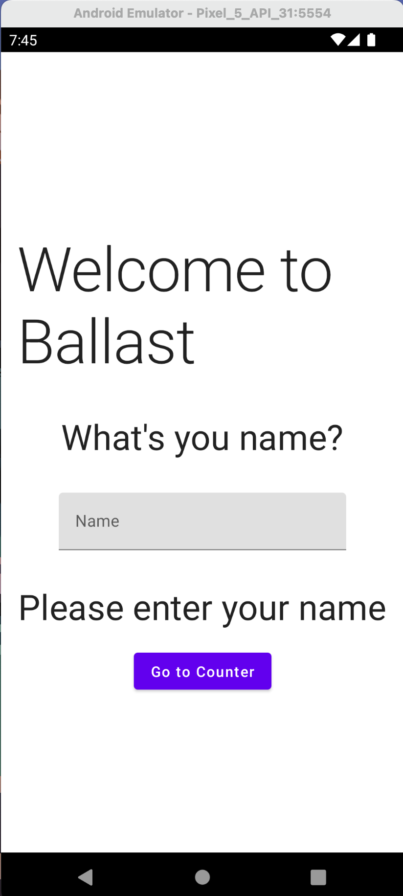
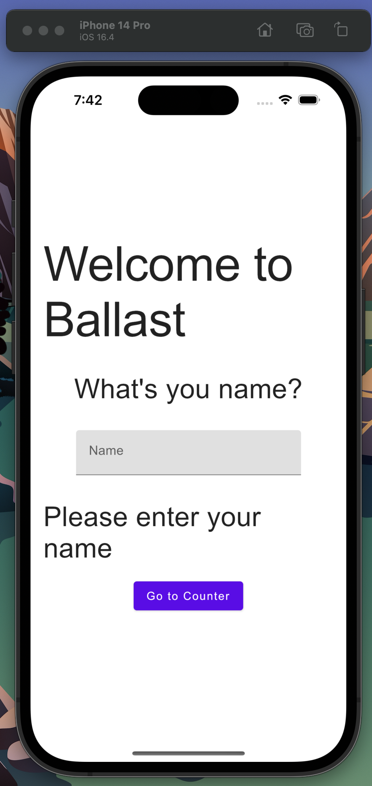
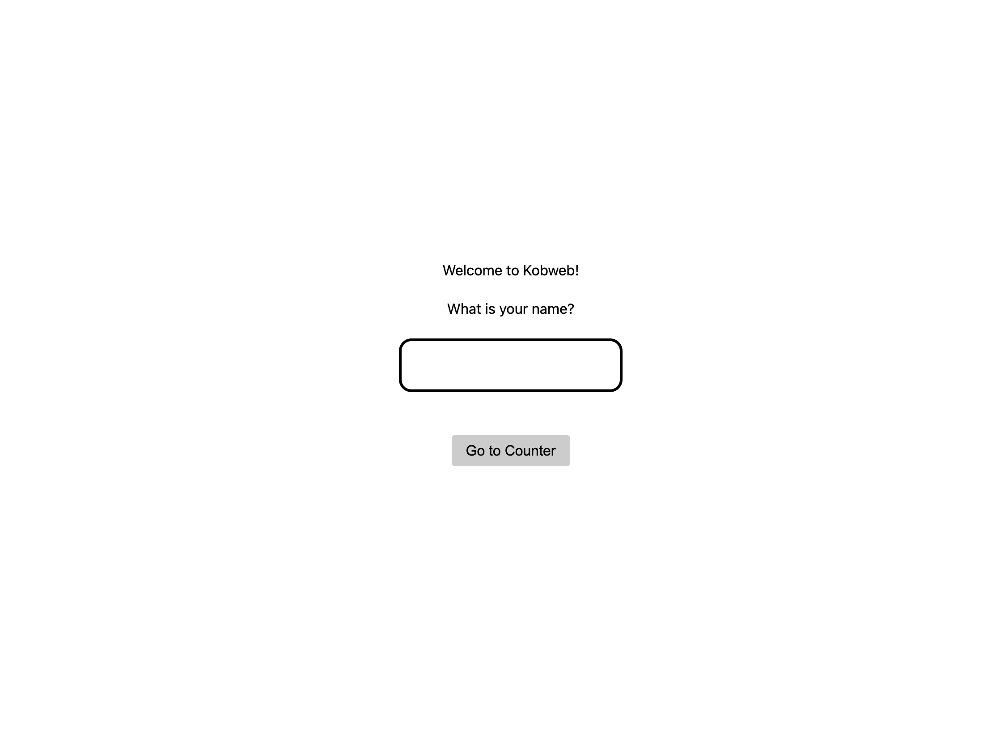
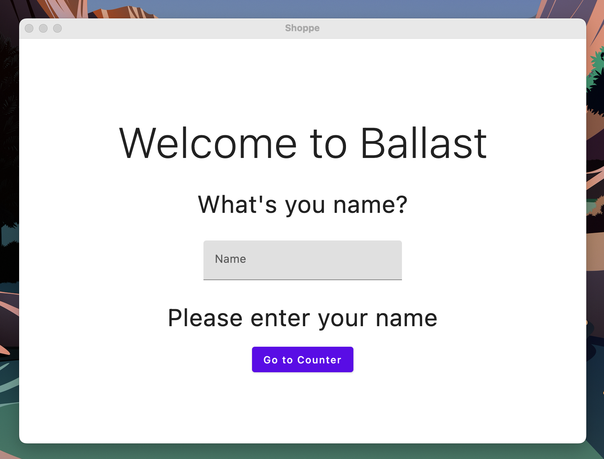

# Shared Compose Multiplatform Example

## Overview

A Kotlin Multiplatform application demonstrating Ballast as the shared state-management layer across Android, iOS,
Desktop, and Web, all sharing a common Compose UI defined in the `shared` module. The web target uses
[Kobweb](https://github.com/varabyte/kobweb).

This example was contributed by [Adrian Witaszak](https://github.com/charlee-dev).

## Platforms

| Platform | Supported |
|----------|-----------|
| Android  | ✅         |
| iOS      | ✅         |
| JVM      | ✅         |
| Web      | ✅         |

## Running Locally

**Android:** Run `androidApp` from the Run Configuration in Android Studio.

**iOS:** Run `iosApp` from the Run Configuration, or open `iosApp/iosApp.xcodeproj` in Xcode and run.

**Desktop:**
```shell
./gradlew :shared:run
```

**Web:**
```shell
./gradlew :web:kobwebStart -t
```

## Screenshots





