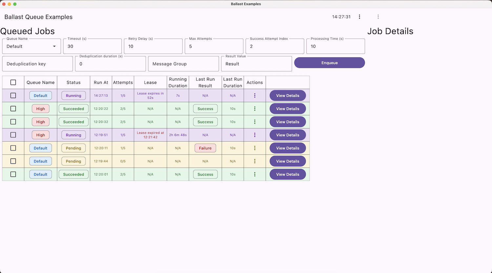

# Ballast Queue Example

## Overview

This example combines many Ballast modules to show a realistic example of a server-side job queue backed by a Postgres
or MySQL database table.

## Setup

1. Run `docker compose up -d` using [this Docker Compose file](./../../ballast-queue-exposed-driver/docker-compose.yml)
2. Manually apply the migration scripts to the database running on localhost (the Intellij Ultimate [Query Console](https://www.jetbrains.com/help/idea/run-a-query.html#run_statements_in_a_query_console))
  is handy for this).
   a. Migration script for [PostgreSQL](./../../ballast-queue-exposed-driver/postgresql_jobs.sql)
   b. Migration script for [MySQL](./../../ballast-queue-exposed-driver/mysql_jobs.sql)
3. Run `./gradlew :examples:queue:run` to start the example

## Using the example

The example provides a simple dashboard for enqueueing jobs, observing their processing states, and running maintenance
tasks, to get a feel for how the Exposed Database job queue functions. 

It runs 3 queue workers in parallel: 1 for each of the `High`, `Default`, and `Low` queue names. These queues are 
managed using [Ballast Autoscale](./../../ballast-autoscale), with the [Ballast Queue Viewmodel](./../../ballast-queue-viewmodel)
JobQueueInputStrategy and [Ballast Queue Exposed Driver](./../../ballast-queue-exposed-driver).

The UI uses a traditional [Ballast Core](./../../ballast-core) ViewModel to manage the UI state, displaying all jobs in 
the queue in a table and refreshing all data every second. You can enqueue new jobs using all the Metadata properties 
described in [Ballast Queue Exposed Driver](./../../ballast-queue-exposed-driver). 

The job processor itself simply simulates work with a coroutine delay. Additionally, the jobs tracks its state to know 
how many times it has been attempted, and uses that to either fail or succeed the job processing based on the 
"Success Attempt Index". Successful jobs will set a Result, which can be observed when clicking "View Details" on a job.
